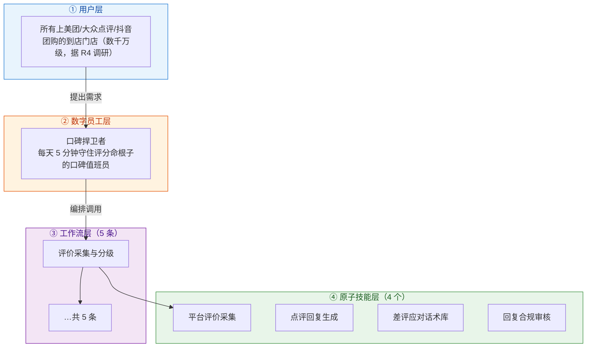
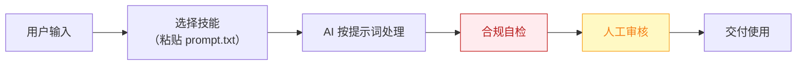

# 口碑捍卫者 — 业务架构

## 四层视图

## 资产形态说明

本资产包为**纯提示词客户端资产**：

| 特性 | 说明 |
|------|------|
| 无运行时依赖 | 不调用任何模型 API，不需要 API Key |
| 平台无关 | 提示词为纯文本，可导入任意主流 AI 平台 |
| 用户自备算力 | 模型由用户自己的订阅提供 |
| 零服务端成本 | 资产方不产生任何调用费用 |

## 数据流

> **关键设计**：所有对外输出必须经过「合规自检 → 人工审核」双闸门。

## 能力边界

| 维度 | 内容 |
|------|------|
| **目标用户** | 所有上美团/大众点评/抖音团购的到店门店（数千万级，据 R4 调研） |
| **做** | **做**：评价监控、情感分级、回复文案生成、差评根因归类、补救建议；** |
| **不做** | 不做**：严禁生成或诱导虚假好评、 |
| **KPI** | 差评响应时长 ≤2 小时；评分回稳（30 天内不回血可退款承诺的支撑指标）；回复采纳率 ≥80% |
| **定价** | 50–200 元/月（V3 差评预警类 50–100 元/月，据 R4 调研）；**代配置服务加成：200–500 元/次**（三平台授权代办+话术库按店定制，客单价低但配置轻，适合作为引流款的增值项） |

---

*本图由 build_p0_assets.py 自动生成*
