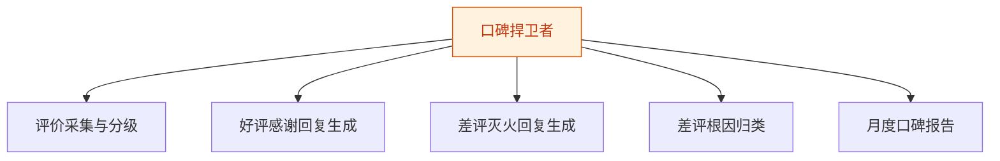
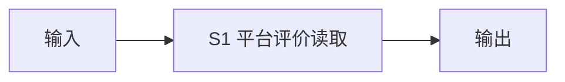
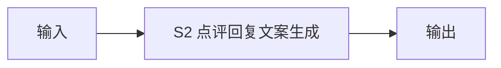
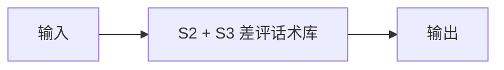
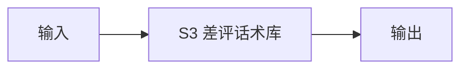
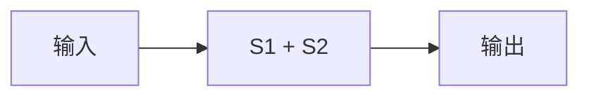

# 口碑捍卫者 — 工作流流程图

本员工共 **5 条工作流**，下辖 **4 个原子技能**。

## 总览

## 分条详情

### 评价采集与分级

| 项目 | 内容 |
|------|------|
| 触发 | 定时（每 2 小时巡检） |
| 复杂度 | `M` |
| 阶段 | `P0` |
| ROI | 替代每日刷后台 ≈ 月省 15 小时 |

### 好评感谢回复生成

| 项目 | 内容 |
|------|------|
| 触发 | 事件（新好评） |
| 复杂度 | `S` |
| 阶段 | `P0` |
| ROI | 每条省 5 分钟，月 100 条 ≈ 8 小时 |

### 差评灭火回复生成

| 项目 | 内容 |
|------|------|
| 触发 | 事件（新差评）→ 即时推送预警 |
| 复杂度 | `S` |
| 阶段 | `P0` |
| ROI | 评分掉 0.3 分=客流少两成（据 R4 调研），单次挽损千元级 |

### 差评根因归类

| 项目 | 内容 |
|------|------|
| 触发 | 定时（每周） |
| 复杂度 | `S` |
| 阶段 | `P0` |
| ROI | 把"挨骂"变成"改进路线图" |

### 月度口碑报告

| 项目 | 内容 |
|------|------|
| 触发 | 定时（每月 1 日） |
| 复杂度 | `S` |
| 阶段 | `P1` |
| ROI | 替代代运营月报（代运营 2000 元/月起） |

## 汇总表

| # | 工作流 | 阶段 | 复杂度 | 触发 | 涉及技能数 |
|---|--------|------|--------|------|-----------|
| 1 | 评价采集与分级 | `P0` | `M` | 定时（每 2 小时巡检） | 1 |
| 2 | 好评感谢回复生成 | `P0` | `S` | 事件（新好评） | 1 |
| 3 | 差评灭火回复生成 | `P0` | `S` | 事件（新差评）→ 即时推送预警 | 1 |
| 4 | 差评根因归类 | `P0` | `S` | 定时（每周） | 1 |
| 5 | 月度口碑报告 | `P1` | `S` | 定时（每月 1 日） | 1 |

---

*本图由 build_p0_assets.py 自动生成*
