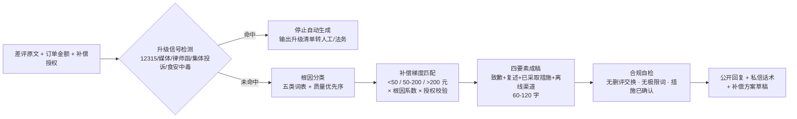

# 差评应对话术库 Negative-Review Script Lib

> 原子技能 ｜ 属于「口碑捍卫者」 ｜ 本地生活商家客群 ｜ T2 提示词型（纯方法论，无脚本）
>
> **差评出现后 2 小时内，给出可直接发布的公开回复 + 私信补救话术 + 梯度内的补偿方案。**
> 内置 5 类根因分类树 · 3 档补偿梯度（<50 / 50-200 / >200 元）· 公开回复四要素 · 60-120 字硬指标 · 5 个升级信号即停规则


🎬 **[▶ 观看演示视频](docs/assets/demo.mp4)** — 四幕创作叙事：业务钩子 → 真实执行 → 要点到成稿演变 → 交付物

*上图来自实跑产物预览：26 元牛肉面差评命中「价格主根因 + 服务次因」，产出 98 字四要素公开回复与 10 元券方案（<50 元档，未超 15 元授权）。*

---

## 它给什么（三类规则，先判根因再选话术）

### 一、根因分类树（类别决定话术骨架与补偿方向）

| 根因 | 典型表述 | 话术核心 | 补偿方向 |
|---|---|---|---|
| 物流 | 破损 / 超时 / 丢件 / 撒漏 | 先认履约责任，再给到货保障 | 运费补偿 + 重发 |
| 质量 | 色差 / 故障 / 过期 / 异物 | 认问题 + 讲已发生的整改动作 | 退款 / 换货优先于发券 |
| 期望差 | 图片与实物不符 / 描述夸大 | 承认展示有偏差，补真实信息 | 差价退还 / 换购 |
| 服务 | 态度差 / 等位久 / 上错菜 | 点名环节致歉 + 已做的流程修正 | 当次免单 / 折扣 |
| 价格 | 觉得不值 / 分量少 | 不辩解定价，摆分量与成本构成 | 满减券拉复购 |

一句话命中多类时，按「质量 > 服务 > 物流 > 期望差 > 价格」取最重的作主根因。

### 二、补偿梯度（按订单实付金额）

| 订单金额 | 补偿档位 | 话术姿态 |
|---|---|---|
| < 50 元 | 5-10 元无门槛券 | 私信轻补，公开回复不提金额 |
| 50-200 元 | 订单额 10%-20% 的券或退款 | 私信给出具体金额与有效期 |
| > 200 元 | 专人对接 + 电话沟通 | 公开回复只留渠道，不在线上承诺 |

**红线**：补偿的交换条件只能写「欢迎再给一次机会」——「删差评后补发」「改好评返现」违反平台评价规范并触及《反不正当竞争法》第八条。

### 三、公开回复四要素（缺一不可）+ 硬指标

1. **致歉**：认问题不认罪，不推责快递员、不辩解「天气原因」
2. **复述具体问题**：写出客户原话细节（菜品名、环节、时间），禁止套话
3. **已采取的措施**：写已完成的动作，不写「我们会加强管理」式空承诺
4. **离线沟通渠道**：店长电话或私信入口，把纠纷引到一对一

硬指标：公开回复 **60-120 字**；差评出现后 **2 小时内响应**（24 小时后挽回效果减半）；全量差评**回复率 100%**。

## 真实输入 → 真实输出

**输入**（`examples/input.json`）：

```json
{
  "reviews": "分量越来越少了，一份牛肉面就三片牛肉，价格还涨了，等了 25 分钟才上桌，不会再来了",
  "policy": "可发优惠券，单张最高 15 元；小额退款需店长批",
  "order_amount": 26
}
```

**输出**（按 prompt.txt 方法论生成，节选）：

| 项 | 内容 |
|---|---|
| 主根因 | 价格（分量感知与涨价叠加） |
| 次根因 | 服务（25 分钟等位，公开回复中带过） |
| 公开回复（98 字，含四要素） | 「您好，看到您反馈的三片牛肉与 25 分钟等位问题，很抱歉这次没有做好。门店上周已恢复牛肉面 150g 出餐克重并增加高峰期双人出餐。方便的话请私信店长，我们核实后处理。」 |
| 补偿方案 | 10 元无门槛券（<50 元档，未超 15 元授权） |
| 人工确认 | ✅「恢复 150g 出餐克重」需确认已执行 |

完整方案（含私信话术、补救建议、升级预警、质量自检）见 [`examples/output.md`](examples/output.md)。

## 处理流水线



## 快速开始

```text
1. 打开 prompt.txt，全文复制
2. 粘贴到 Coze / WorkBuddy / Dify / Claude / ChatGPT
3. 按 schema.json 的输入规格提供：差评原文 + 订单金额 + 补偿授权口径
```

## 面向谁 / 什么时候用

| ✅ 该用 | ❌ 别用 |
|---|---|
| 差评出现后要在 2 小时内给出得体的公开回复 | 生成「返现换好评」「送菜删差评」等违规话术（本库拒绝） |
| 补偿方案拿不准档位与授权口径，要梯度内方案 | 在公开区直接承诺退款金额（退款应走私信） |
| 疑似恶意差评，需要平台申诉材料要点而非对线回复 | 替代店主做超授权的资金决策（>200 元必须人工执行） |

## 边界与合规

- 本资产输出为 **AI 辅助生成内容**，公开发布前必须经店主确认
- 补偿涉及资金，仅出方案草稿；**>200 元订单的方案必须人工执行**
- 不编造整改动作——措施必须是已确认发生的，不确定就标「需确认」
- 平台评价规则以美团/点评/抖音官方最新公示为准，本话术库不构成法律意见

## 文件地图

```text
├── README.md                ← 本文件
├── SKILL.md                 ← 资产定义（元信息 / 契约 / 边界）
├── prompt.txt               ← 提示词本体（根因树 + 补偿梯度 + 四要素 + 禁止事项）
├── schema.json              ← 输入输出契约（机器可读）
├── examples/                ← 真实输入 + 按方法论生成的完整输出
└── docs/                    ← 9 项配套文档（架构 / 流程 / 场景 / 测试报告…）
```

---

*本资产遵循 [bangwozuo 数字员工资产规范](https://github.com/bangwozuo/digital-employee-spec) v3.0 ｜ [所属员工：口碑捍卫者](../../) ｜ [总入口](https://github.com/bangwozuo/digital-employees-hub-zh)*
