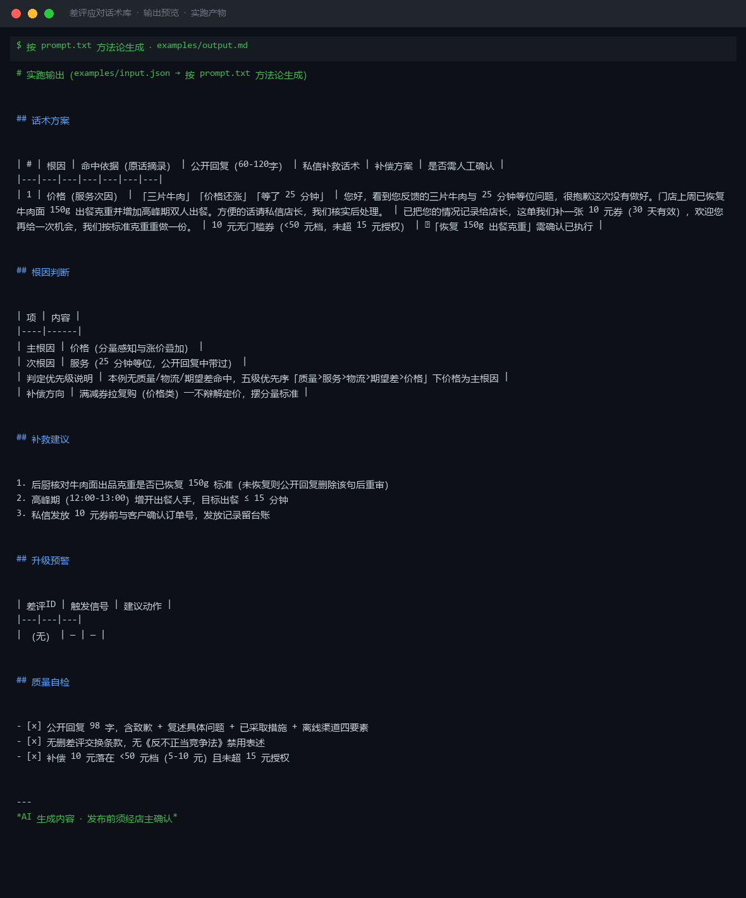

# 截图与录屏

> 以下素材均来自**真实执行**：`--run` 实拍终端 / 实跑产物文件，无摆拍。

## 演示视频


*Hyperframes 动态渲染 11s：命令逐字敲入（光标闪烁）→ 21 行真实输出逐行流式 → 完成态保持*

## 执行截图




---

## 附录：实跑输出明细

> 本资产为纯提示词客户端资产，无界面可截图。以下为**实跑运行效果**。

## 运行效果

### 输入

```json
{
  "reviews": "商品很好，物流慢了点",
  "root_cause": "物流延迟",
  "policy": "可补偿优惠券，最高 20 元"
}

```

### 输出

## 回复文案

| # | 评价要点 | 回复文案 | 处置动作 |
|---|---|---|---|
| 1 | 商品很好 | 感谢您对我们商品的认可，我们会继续努力为您提供优质的产品。 | 记录好评点 |
| 2 | 物流慢了点 | 非常抱歉给您带来了不好的购物体验。由于物流环节延误，导致您未能及时收到商品，我们深表歉意。 | 补偿 10 元优惠券 |

## 根因判断

| 项 | 内容 |
|----|------|
| 根因标签 | 物流延迟 |
| 判断依据 | 用户明确提及"物流慢了点"，属于物流履约问题 |
| 责任方 | 第三方物流/仓储发货环节 |

## 补救建议

1. 主动向用户发放 10 元无门槛优惠券（在 20 元授权范围内），并说明使用规则与有效期
2. 同步物流合作方核查该订单延误原因，评估是否需切换物流渠道
3. 在后台标记该用户偏好，后续订单优先发极速物流

---
*本内容系 AI 生成，仅供参考，涉及补偿方案需经人工确认后执行。*


---

*运行效果由实跑验证生成*
