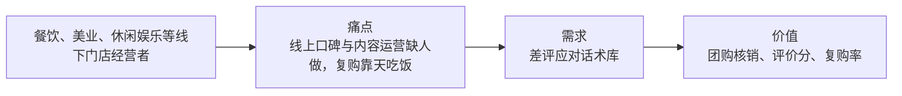

# 差评应对话术库 · 用户群体

## 一、核心用户

| 维度 | 描述 |
|------|------|
| 身份 | 餐饮、美业、休闲娱乐等线下门店经营者 |
| 团队规模 | 单店或 2-5 家连锁，无专职线上运营 |
| 使用场景 | 门店线上经营（探店内容、评价维护、私域复购） |
| 主要渠道 | 抖音团购 / 大众点评 / 美团 / 视频号 / 企微 |
| 核心指标 | 团购核销、评价分、复购率 |

## 二、用户画像

## 三、谁最适合

| 特征 | 适配度 |
|------|-------|
| 有基础业务数据，愿意花 10 分钟配置 | ⭐⭐⭐⭐⭐ |
| 追求「够用就好」，接受人工审核 | ⭐⭐⭐⭐⭐ |
| 已订阅任一 AI 工具 | ⭐⭐⭐⭐⭐ |
| 完全不愿投入任何配置时间 | ⭐⭐ |
| 要求全自动、零人工 | ⭐ |

## 四、谁不适合

- 需要**完全自动化**、拒绝任何人工环节的用户
- 没有任何业务数据、期望「输入一句话就出成品」的用户
- 涉及**资金 / 法律 / 医疗决策**，需要持证专业意见的用户

## 五、用户价值主张

> 给 **餐饮、美业、休闲娱乐等线下门店经营者** 一个能立刻用上的 **差评应对话术库**：
> 不装软件、不填密钥、不学新工具，
> 复制一段提示词，就把这件事**从「不会做 / 没时间做」变成「10 分钟出初稿」**。

---

*客群归属：本地生活商家 ｜ 所属数字员工：口碑捍卫者*
