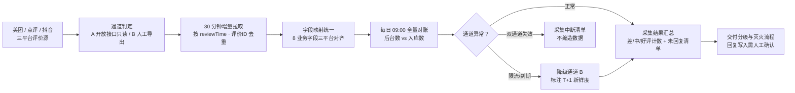

# 平台评价采集 Platform Review Collect

> 原子技能 ｜ 属于「口碑捍卫者」 ｜ 本地生活商家客群 ｜ T4 调度型（纯提示词，产出采集 SOP 与字段映射）
>
> **给美团 / 点评 / 抖音三平台的评价数据定一套采集 SOP：什么时候采、走哪条通道、断了怎么降级。**
> 3 平台统一字段映射（8 个业务字段）· 3 时点采集时间轴（30 分钟增量 / 每日对账 / 每月归档）· A/B 双通道 + 降级路径 · 黄金 2 小时窗口驱动


*上图来自实跑产物预览：09:00 对账批次产出三平台采集汇总（美团 3 / 点评 2 / 抖音 1），抖音接口限流自动降级通道 B 并标注 T+1 新鲜度。*

---

## 它管什么（采集范围与字段映射）

### 三平台统一输出结构（8 个业务字段）

| 业务字段 | 美团/点评来源 | 抖音来客来源 | 方向 | 说明 |
|---|---|---|---|---|
| 评价ID | reviewId | review_id | 读 | 幂等去重键，跨批次不重复入库 |
| 星级 | score（1-5） | score（1-5） | 读 | 1-2 差评 / 3 中评 / 4-5 好评 |
| 评价正文 | content | content | 读 | 供根因分类与回复生成 |
| 订单号 | orderId | order_id | 读 | 恶意差评申诉与补偿核对凭据 |
| 发布时间 | reviewTime | create_time | 读 | 计算「黄金 2 小时」响应窗口 |
| 商家回复状态 | replyStatus | reply_status | 读 | 回复率 100% 目标的缺口清单 |
| 回复内容 | replyContent | reply_content | 读/写 | 写操作需人工确认后执行 |
| 平台 | 固定值 | 固定值 | 读 | 多平台聚合必带 |

### 采集 SOP 时间轴

| 时点 | 动作 | 说明 |
|---|---|---|
| 实时（推荐）/ 每 30 分钟 | 拉取三平台**新增**评价（按 reviewTime 增量） | 差评 2 小时黄金窗口要求采集频率 ≤ 30 分钟 |
| 每日 09:00 | 全量对账：平台后台评价数 vs 已入库数 | 补漏；发现漏采差评立即触发补采 |
| 每月 1 日 | 导出上月全量评价归档（CSV） | 供月度口碑报告流程使用 |

### 授权与降级路径（只读连接器）

- **通道 A（推荐）**：平台开放接口 / 官方服务商应用，只读权限；授权由店主在商家后台操作
- **通道 B（降级）**：接口未开通 / 到期 / 限流时，降级为商家后台每日人工导出，标注 T+1 新鲜度
- **双通道都不可用**：输出「采集中断」清单（平台 / 最后成功时间 / 建议动作），**不编造任何评价数据**

## 真实输入 → 真实输出

**输入**（`examples/input.json`）：

```json
{
  "platforms": ["美团", "点评", "抖音"],
  "channel": "A",
  "frequency": "每 30 分钟增量，每日 09:00 对账",
  "last_success_at": "2026-09-30 08:30"
}
```

**输出**（按 prompt.txt 方法论生成，节选）：

| 平台 | 新增条数 | 差评 | 中评 | 好评 | 未回复差评 | 通道 |
|---|---|---|---|---|---|---|
| 美团 | 3 | 1 | 0 | 2 | 1 | A |
| 点评 | 2 | 0 | 0 | 2 | 0 | A |
| 抖音 | 1 | 0 | 1 | 0 | 0 | A |

异常与降级：抖音接口限流（HTTP 429）→ 当日转通道 B 人工导出，标注 T+1 新鲜度；差评按「发现即响应」处理。完整配置单、操作清单与能力边界见 [`examples/output.md`](examples/output.md)。

## 处理流水线



## 快速开始

```text
1. 打开 prompt.txt，全文复制
2. 粘贴到 Coze / WorkBuddy / Dify / Claude / ChatGPT
3. 按 schema.json 的输入规格提供：平台清单 + 通道 + 采集频率 + 上次成功时间
```

> 本资产为**纯提示词形态**：产出的是字段映射、采集时间轴与操作清单，实际授权与调用由商家在平台商家后台完成。

## 面向谁 / 什么时候用

| ✅ 该用 | ❌ 别用 |
|---|---|
| 为三平台评价数据制定采集频率、字段映射与对账制度 | 用爬虫抓取评价（违反平台协议，会被封禁商家接口权限） |
| 接口限流 / 到期时设计降级路径，保证差评不漏采 | 承诺「可删差评」——平台无此接口，声称可删评的服务均违规 |
| 首次授权绑定门店时生成操作清单 | 采集评价之外的客户个人信息（手机号、头像、主页） |

## 边界与合规

- 本资产输出为 **AI 辅助生成内容**，采集配置变更需店主确认
- 只做**只读采集**与经人工确认的回复写入；不批量改写、不删除评价
- 采集频率遵守平台接口配额（如美团开放平台默认 QPS 限制）
- 评价数据使用遵守《个人信息保护法》最小必要原则；仅用于本店口碑运营，不对第三方转让

## 文件地图

```text
├── README.md                ← 本文件
├── SKILL.md                 ← 资产定义（元信息 / 契约 / 边界）
├── prompt.txt               ← 提示词本体（字段映射 + 采集 SOP + 降级路径 + 合规红线）
├── schema.json              ← 输入输出契约（机器可读）
├── examples/                ← 真实输入 + 按方法论生成的完整输出
└── docs/                    ← 9 项配套文档（架构 / 流程 / 场景 / 测试报告…）
```

---

*本资产遵循 [bangwozuo 数字员工资产规范](https://github.com/bangwozuo/digital-employee-spec) v3.0 ｜ [所属员工：口碑捍卫者](../../) ｜ [总入口](https://github.com/bangwozuo/digital-employees-hub-zh)*
