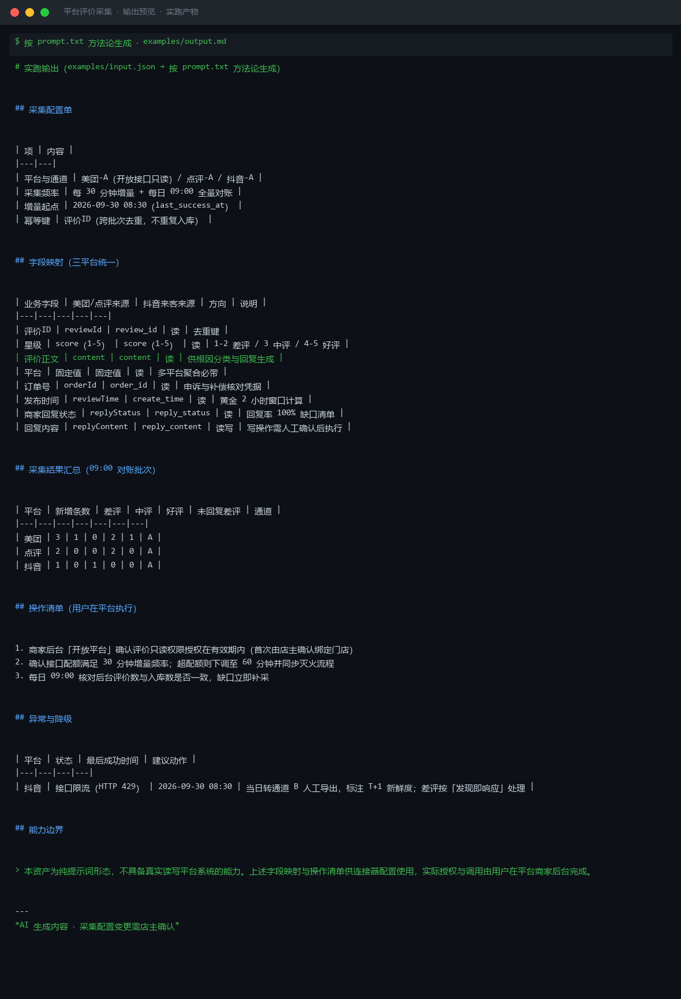

# 截图与录屏

> 以下素材均来自**真实执行**：`--run` 实拍终端 / 实跑产物文件，无摆拍。

## 演示视频


*第二帧为实跑结果数据*

## 执行截图




---

## 附录：实跑输出明细

> 本资产为纯提示词客户端资产，无界面可截图。以下为**实跑运行效果**。

## 运行效果

### 输入

```json
{
  "system": "企业微信",
  "task": "读取客户列表并发送通知"
}

```

### 输出

## 字段映射

| 业务字段 | 系统字段 | 方向 | 说明 |
|---|---|---|---|
| 客户姓名 | external_userid → name | 读 | 企业微信外部联系人名称 |
| 客户手机号 | follow_user → remark_mobiles | 读 | 备注手机号，需授权 |
| 客户标签 | external_profile → tag_name | 读 | 企业给客户打的标签 |
| 通知内容 | message → text → content | 写 | 通过应用消息或群发接口发送 |
| 发送状态 | send_status | 写 | 消息发送结果回调 |

## 操作清单

1. 调用企业微信「获取客户列表」接口（/externalcontact/list），读取 external_userid 列表
2. 遍历客户列表，调用「获取客户详情」接口（/externalcontact/get），提取 name、remark_mobiles、tag_name
3. 组装通知文案，调用「发送应用消息」接口（/message/send）或「企业群发」接口（/externalcontact/add_msg_template）
4. 记录发送状态，处理失败重试或人工兜底

## 能力边界

> **声明**：本资产为纯提示词形态，不具备真实读写企业微信系统的能力。上述字段映射与操作清单仅供参考，实际执行需由用户在企业微信开放平台或对应连接器中完成授权与调用。

---
*本内容系 AI 生成，仅供参考。*


---

*运行效果由实跑验证生成*
