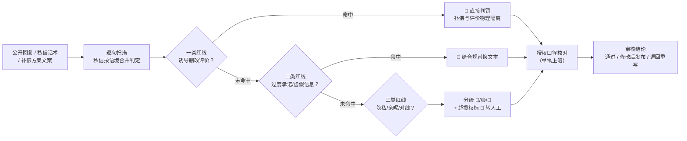

# 回复合规审核 Reply Compliance Review

> 原子技能 ｜ 属于「口碑捍卫者」 ｜ 本地生活商家客群 ｜ T2 提示词型（纯方法论，无脚本）
>
> **在商家回复 / 私信话术发布前，把会引来平台处罚或法律风险的表述挑出来，并给出可直接替换的合规写法。**
> 3 类红线逐类扫描（诱导删改评价 / 过度承诺 / 隐私与不当互动）· 3 级判定（🔴 红线 / 🟡 警告 / 🔵 提示）· 每条给替换文本 · 私信按语境合并判定（分句书写不豁免）


🎬 **[▶ 观看演示视频](docs/assets/demo.mp4)** — 四幕检测叙事：业务钩子 → 真实执行 → 检查项逐条亮灯 → 交付物

*上图来自实跑产物预览：2 条私信话术命中红线 1 / 警告 1 / 提示 1，整体判定「退回重写」——「补 20 元，您看能不能把那条评价改一下」同时触平台评价诚信规则与《反不正当竞争法》第八条。*

---

## 它查什么（三类红线，全部有真实处罚依据）

### 一类：诱导删改评价（最重，直接触发处罚）

| 表述形式 | 依据与后果 |
|---|---|
| 「删除差评返现 / 改好评送菜 / 评价截图领券 / 好评有礼」 | 违反美团/点评评价诚信规则：删除评价、星级降权、活动下架（视情节 7-90 天） |
| 「给您补偿，您看能不能把评价改一下」 | 补偿与评价动作同句即算关联，《反不正当竞争法》第八条，**罚款起点 10 万元** |
| 私信先谈补偿、隔几句再问「评价那边…」 | 分句书写不豁免，按语境合并判定 |

**合规写法**：补偿与评价**物理隔离**——补偿话术只讲「解决问题、欢迎再给一次机会」，全文不出现「评价」「好评」「差评」「删」四个词中的任何一个。

### 二类：过度承诺与虚假信息

| 表述 | 问题 | 合规改法 |
|---|---|---|
| 「下次绝对不会有这个问题」 | 绝对化承诺，做不到即虚假宣传 | 「我们已按您说的环节做了调整」 |
| 「本店食材全网最好 / 排名第一」 | 《广告法》第九条绝对化用语 | 「食材当日现购，公开进货台账」 |
| 「吃出问题我们全责包赔一切」 | 无边界责任承诺 | 「已反馈后厨核查，会给您明确答复」 |
| 「已获评 XX 最佳餐厅」（无依据） | 编造荣誉 | 删除，或附真实奖项与年份 |
| 「别的客人吃了都没事」 | 用他人体验做安全性背书 | 只谈本案事实与已采取措施 |

### 三类：隐私与不当互动

- 回复中暴露客户手机号 / 全名 / 桌号 / 消费金额 / 病史过敏史 —— 违反《个人信息保护法》，平台脱敏检测命中即驳回
- 「亲亲」「宝宝」过度亲昵 + 连发表情包 —— 平台判定的「营销骚扰」高危特征
- 公开区对线（「监控显示您…」）—— 即使占理也会被围观截图放大，只能私信沟通

### 三级判定

| 级别 | 含义 | 处理 |
|---|---|---|
| 🔴 红线 | 触平台处罚或三部法律 | 必须改，给出替换文本 |
| 🟡 警告 | 高概率被判敷衍/骚扰 | 建议改 |
| 🔵 提示 | 需补充事实依据才可用 | 核实后再发布 |

**不误报**：「欢迎再给一次机会」「期待您再次光临」是合规的，不扩大打击面。

## 真实输入 → 真实输出

**输入**（`examples/input.json`）：

```json
{
  "text": "1. 很抱歉这次体验不好，我们给您补 20 元，您看能不能把那条评价改一下？\n2. 抱歉让您等久了。本单我们承担 15 元退款（已按授权办理），欢迎您再给一次机会。后厨已换供应商，下次来一定不一样。",
  "platform": "点评",
  "policy": "券/退款单笔授权上限 15 元"
}
```

**输出**（按 prompt.txt 方法论生成，违规清单节选）：

| # | 级别 | 原文片段 | 命中红线 | 依据 | 合规改法 |
|---|---|---|---|---|---|
| 1 | 🔴 | 「补 20 元，您看能不能把那条评价改一下」 | 诱导删改评价 | 平台评价诚信规则 /《反不正当竞争法》第八条 | 删除全句；补偿话术与评价动作物理隔离 |
| 2 | 🟡 | 「下次来一定不一样」 | 过度承诺 | 做不到即虚假宣传 | 改为「已按您反馈的环节做了调整」 |
| 3 | 🔵 | 「补 20 元」「后厨已换供应商」 | 超授权 / 事实待核 | 授权口径单笔上限 15 元 | 金额改 ≤15 元并经店长确认；「换供应商」需采购单据佐证 |

整体判定：**退回重写**（重写后全文不得出现「评价/好评/差评/删」四词）。完整审核结论与人工复核提醒见 [`examples/output.md`](examples/output.md)。

## 处理流水线



## 快速开始

```text
1. 打开 prompt.txt，全文复制
2. 粘贴到 Coze / WorkBuddy / Dify / Claude / ChatGPT
3. 按 schema.json 的输入规格提供：待审文本 + 平台 + 补偿授权口径
```

## 面向谁 / 什么时候用

| ✅ 该用 | ❌ 别用 |
|---|---|
| 任何公开回复 / 私信话术 / 补偿文案发布前的最后一道审查 | 提供规避检测的写法（谐音、拆字、图片文字）——属违规协助，本资产拒绝 |
| 拿不准「补偿能不能和评价出现在同一句话里」时 | 审核商品定价、成本等实质经营信息 |
| 核对补偿表述是否超出商家授权口径 | 替代法务意见（重大争议由法务复核） |

## 边界与合规

- 本审核为 **AI 预审**，输出标注「AI 生成内容」，不构成法律意见
- 平台规则每月可能更新，发布前对照官方最新规范二次确认
- 涉及食安、人身伤害的回复一律转人工/法务定稿
- 不编造违规项——没有依据的词不报违规

## 文件地图

```text
├── README.md                ← 本文件
├── SKILL.md                 ← 资产定义（元信息 / 契约 / 边界）
├── prompt.txt               ← 提示词本体（三类红线 + 判定分级 + 输出格式）
├── schema.json              ← 输入输出契约（机器可读）
├── examples/                ← 真实输入 + 按方法论生成的完整输出
└── docs/                    ← 9 项配套文档（架构 / 流程 / 场景 / 测试报告…）
```

---

*本资产遵循 [bangwozuo 数字员工资产规范](https://github.com/bangwozuo/digital-employee-spec) v3.0 ｜ [所属员工：口碑捍卫者](../../) ｜ [总入口](https://github.com/bangwozuo/digital-employees-hub-zh)*
