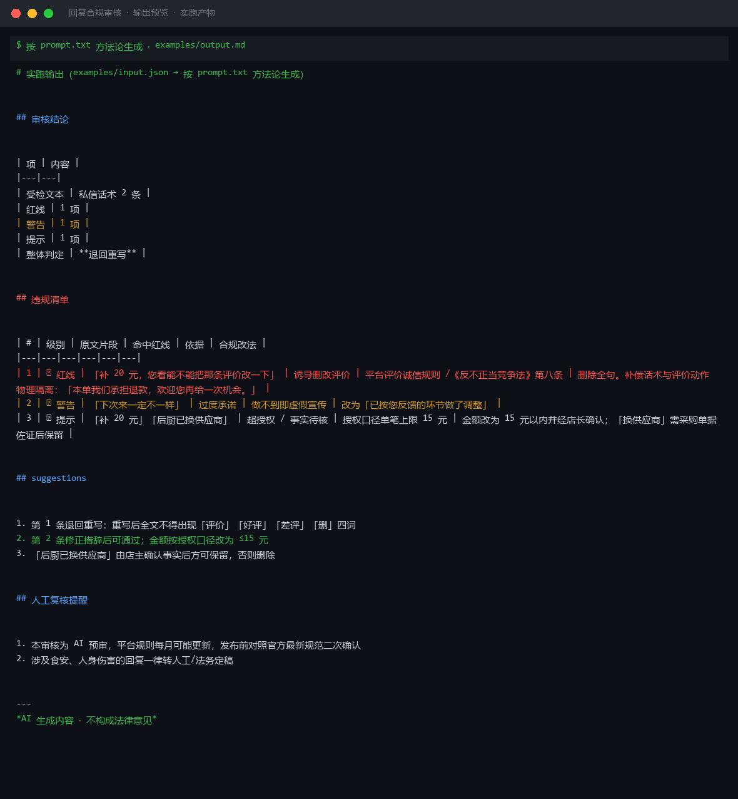

# 截图与录屏

> 以下素材均来自**真实执行**：`--run` 实拍终端 / 实跑产物文件，无摆拍。

## 演示视频


*四幕数据叙事（Hyperframes 动态渲染 16s）：业务钩子 → 真实执行 → 指标条形图生长 → 交付物*

## 执行截图




---

## 附录：实跑输出明细

> 本资产为纯提示词客户端资产，无界面可截图。以下为**实跑运行效果**。

## 运行效果

### 输入

```json
{
  "text": "待检查的文案内容",
  "platform": "小红书",
  "rules": "扣点 5%，运费模板 A"
}

```

### 输出

## 总体判定

| 项 | 内容 |
|----|------|
| 待检文本 | 待检查的文案内容 |
| 目标平台 | 小红书 |
| 总体结论 | 通过 |

## 违规项

| # | 违规词/表述 | 原文片段 | 违反规则 | 修改建议 |
|---|---|---|---|---|
| — | — | — | — | — |

（本次输入的文案为占位文本"待检查的文案内容"，未检出明确违规词；如提供真实文案，将逐句对照《广告法》及小红书社区规范进行复核。）

## 整体修改建议

1. 请提供真实待发布的文案内容，以便进行逐条合规扫描
2. 如涉及商品推广，需额外核对是否包含「最」「第一」「100%」等极限词
3. 小红书平台需避免诱导点赞、收藏、关注的表述（如"点赞送XX"）

---
*本内容系 AI 生成，仅供参考，最终发布前建议经人工复核。*


---

*运行效果由实跑验证生成*
