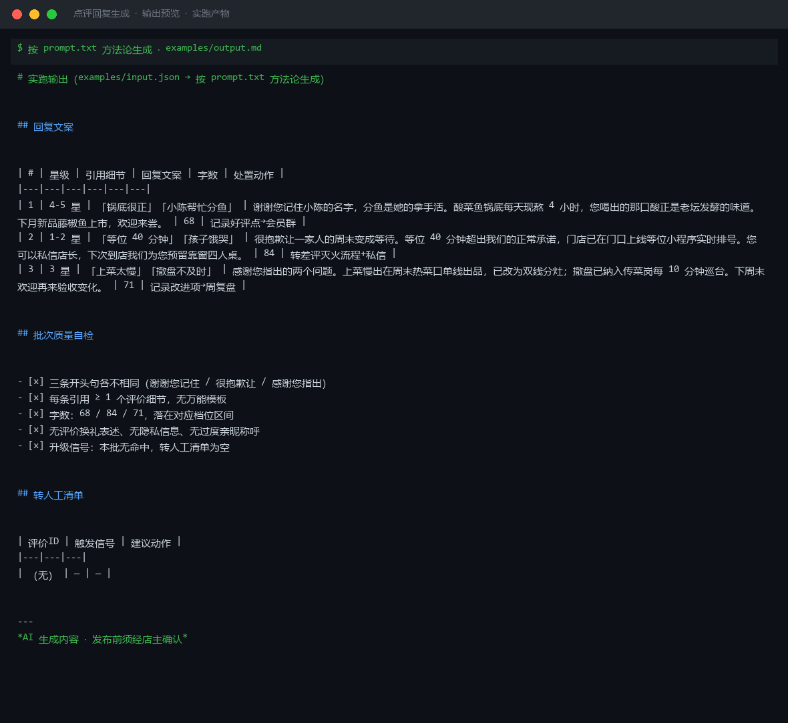
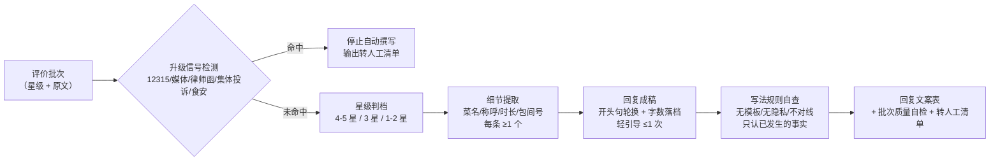

# 点评回复生成 Review Reply Generate

> 原子技能 ｜ 属于「口碑捍卫者」 ｜ 本地生活商家客群 ｜ T2 提示词型（纯方法论，无脚本）
>
> **把每条评价里的具体细节提取出来，生成「像店长亲手写的」个性化回复——好评回出温度、中评回出改进、差评回出担当。**
> 3 档星级策略（4-5 星 / 3 星 / 1-2 星）· 每条必须引用 ≥1 个评价细节 · 开头句同批不重复 · 50-100 / 60-120 字数分档 · 5 个升级信号即停




🎬 **[▶ 观看高清完整版（mp4）](https://cdn.jsdelivr.net/gh/bangwozuo/review-firefighter-zh@main/skills/review-reply-generate/docs/assets/demo.mp4)** — 四幕创作叙事：业务钩子 → 真实执行 → 要点到成稿演变 → 交付物

*上图来自实跑产物预览：3 条评价（5 星 / 2 星 / 3 星）生成 68 / 84 / 71 字回复，三条开头句各不相同，每条引用评价原文细节，批次自检全过。*

---

## 为什么必须个性化（平台机制，不是感觉）

美团/点评/抖音的门店排序把**商家回复率与回复速度**作为加权因子：

- 差评出现后 **2 小时内**回复挽回效果最高，超过 **24 小时**效果减半
- 差评回复率要做到 **100%**——漏回一条就在丢曝光
- 「感谢亲的支持，欢迎下次光临」这类万能模板会被平台与用户同时识别为敷衍，等于没回

所以每条回复**必须引用评价里的至少 1 个具体细节**（菜名、店员称呼、等位时长、包间号都算）。

## 按星级分档的策略（先判档，再动笔）

| 星级 | 定位 | 回复骨架 | 字数 |
|---|---|---|---|
| 4-5 星 | 复购催化剂 | 具体致谢（复述细节）+ 人格化一句 + 轻引导（≤1 次，不设交换条件） | 50-100 字 |
| 3 星 | 改进金矿 | 感谢指正 + 点名改进步骤 + 邀请再来的具体理由 | 60-120 字 |
| 1-2 星 | 危机处置 | 致歉 + 复述问题 + 已采取措施 + 离线渠道（走差评灭火流程） | 60-120 字 |

> 分寸：美团/点评明令禁止「评价换礼」，「凭本条评价送小食」这类写法需先确认平台允许，写不出来就删掉引导句。

## 写法规则（决定像不像人写的）

1. **开头不重复**：同一批回复里开头句不得出现两次
2. **称呼自然**：用「您」或评价里的自称，禁用「亲亲」「宝宝」「小主」
3. **只认事实**：措施写已发生的，没发生的写「正在…」
4. **不辩解不对线**：客户说难吃，不回「可能不合您口味」；有误解先接住再私下澄清
5. **隐私脱敏**：不出现客户手机号、全名、桌号、消费金额等可识别信息
6. **一评一回**：同一评价只回复一次，后续追问转私信

## 真实输入 → 真实输出

**输入**（`examples/input.json`，节选）：

```json
{
  "batch": [
    {"id": "R01", "stars": 5, "text": "酸菜鱼锅底很正，鱼肉嫩滑没刺，服务员小陈还帮忙分了鱼"},
    {"id": "R02", "stars": 2, "text": "等位 40 分钟才吃上，孩子都饿哭了，虽然味道还行但体验太差"}
  ],
  "policy": "无补偿授权，仅回复；店长私信渠道已开通"
}
```

**输出**（按 prompt.txt 方法论生成，节选）：

| # | 星级 | 引用细节 | 回复文案（节选） | 字数 | 处置动作 |
|---|---|---|---|---|---|
| 1 | 4-5 星 | 「锅底很正」「小陈帮忙分鱼」 | 谢谢您记住小陈的名字，分鱼是她的拿手活。酸菜鱼锅底每天现熬 4 小时……下月新品藤椒鱼上市，欢迎来尝。 | 68 | 记录好评点→会员群 |
| 2 | 1-2 星 | 「等位 40 分钟」「孩子饿哭」 | 很抱歉让一家人的周末变成等待。等位 40 分钟超出我们的正常承诺，门店已在门口上线等位小程序实时排号…… | 84 | 转差评灭火流程+私信 |
| 3 | 3 星 | 「上菜太慢」「撤盘不及时」 | 感谢您指出的两个问题。上菜慢出在周末热菜口单线出品，已改为双线分灶；撤盘已纳入传菜岗每 10 分钟巡台…… | 71 | 记录改进项→周复盘 |

批次自检：三条开头句各不相同（谢谢您记住 / 很抱歉让 / 感谢您指出）· 字数均落档 · 无评价换礼 · 无隐私信息。完整输出见 [`examples/output.md`](examples/output.md)。

## 处理流水线



## 快速开始

```text
1. 打开 prompt.txt，全文复制
2. 粘贴到 Coze / WorkBuddy / Dify / Claude / ChatGPT
3. 按 schema.json 的输入规格提供：评价批次（id/星级/原文）+ 补偿授权口径
```

## 面向谁 / 什么时候用

| ✅ 该用 | ❌ 别用 |
|---|---|
| 好评/中评批量回复，要每条不重样、有细节引用 | 生成「好评返现」「评价换菜」及任何变体（本资产拒绝） |
| 差评第一时间的担当式回复（再转灭火流程深处理） | 用万能模板应付——无细节引用的回复视为不合格，必须重写 |
| 评价细节缺失时按「简版回复」处理并标注 | 虚构评价里没有的细节或编造荣誉（「本店获评 XX 奖」） |

## 边界与合规

- 所有回复标注「AI 生成内容」，公开发布前经店主确认
- 回复行为遵守美团/点评/抖音商家评价规范（以官方最新公示为准）
- 涉及食安、人身伤害的评价立即转人工，不自动回复
- 不透露其他客户信息做对比（「别的客人都说好吃」）

## 文件地图

```text
├── README.md                ← 本文件
├── SKILL.md                 ← 资产定义（元信息 / 契约 / 边界）
├── prompt.txt               ← 提示词本体（星级分档 + 写法规则 + 升级信号）
├── schema.json              ← 输入输出契约（机器可读）
├── examples/                ← 真实输入 + 按方法论生成的完整输出
└── docs/                    ← 9 项配套文档（架构 / 流程 / 场景 / 测试报告…）
```

---

*本资产遵循 [bangwozuo 数字员工资产规范](https://github.com/bangwozuo/digital-employee-spec) v3.0 ｜ [所属员工：口碑捍卫者](../../) ｜ [总入口](https://github.com/bangwozuo/digital-employees-hub-zh)*
