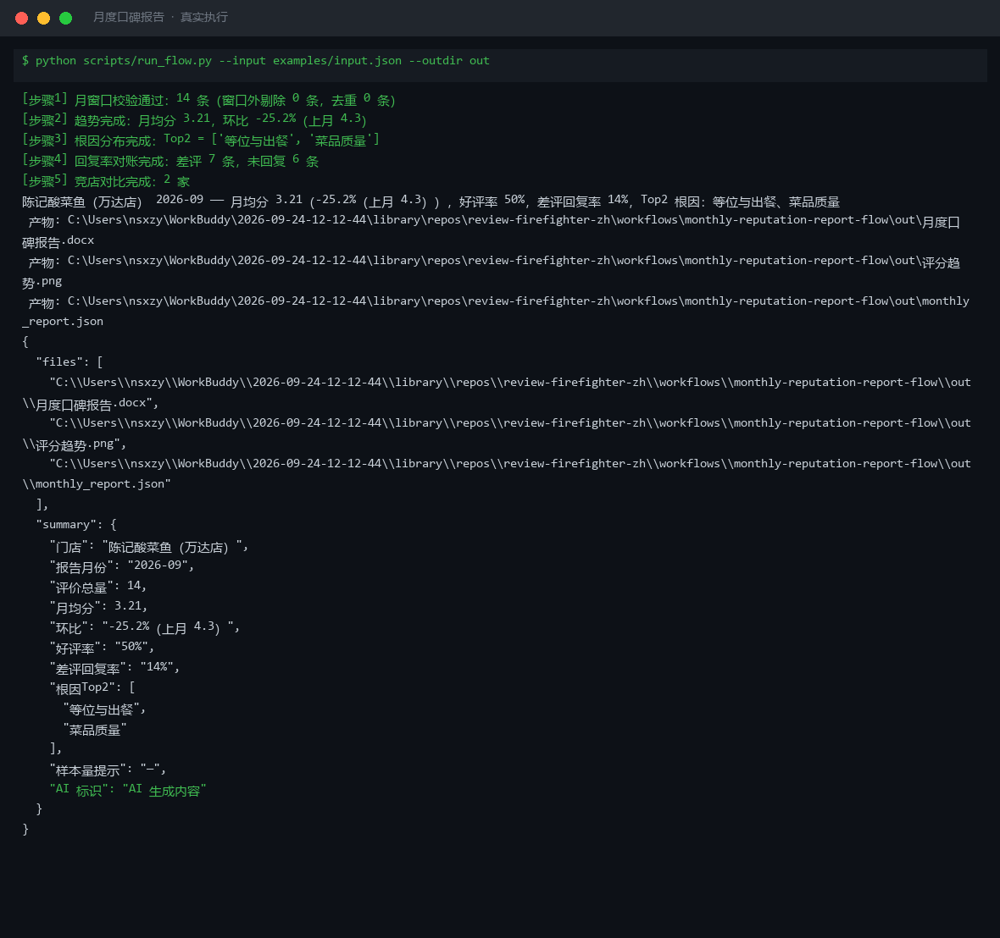
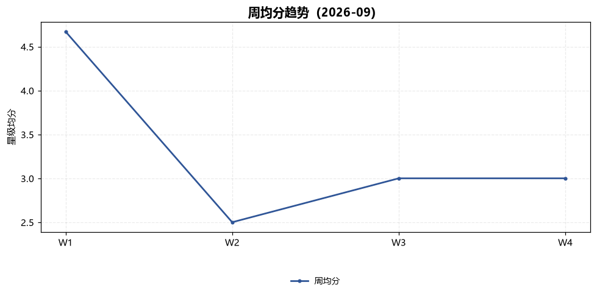
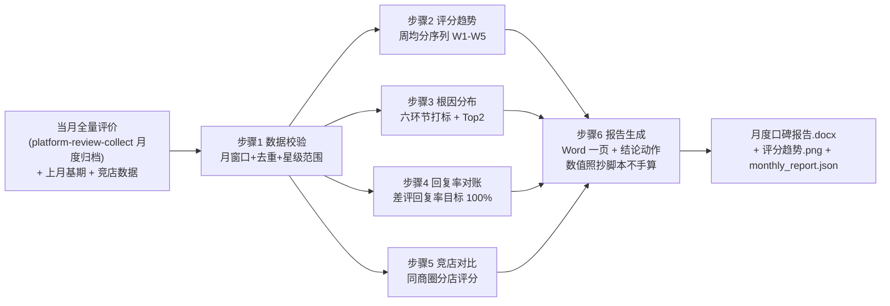

# 月度口碑报告 Monthly Reputation Report Flow

> 复合技能（工作流） ｜ 属于「口碑捍卫者」 ｜ 本地生活商家客群 ｜ T3 编排型（脚本交付真实文件） ｜ 触发：定时（每月 1 日）
>
> **把一个月的评价数据加工成一页老板能直接开周会用的口碑月报：评分趋势、根因分布、回复率缺口、竞店对比、下月三个必改动作。**
> 6 步真实 DAG（4 路并行统计 + 报告汇聚）· W1-W5 周均分趋势（无数据周断线不补零）· 差评回复率对账（目标 100%）· 竞店对比 · 动作上限 3 个且均可验收




🎬 **[▶ 观看高清完整版（mp4）](https://cdn.jsdelivr.net/gh/bangwozuo/review-firefighter-zh@main/workflows/monthly-reputation-report-flow/docs/assets/demo.mp4)** — 四幕数据叙事：业务钩子 → 真实执行 → 指标条形图生长 → 交付物

*上图来自真实执行：`python scripts/run_flow.py --input examples/input.json --outdir out`，14 条评价 → 月均分 3.21（环比 -25.2%），差评回复率仅 14%（7 条差评 1 条已回复），根因 Top1 等位与出餐 44%，产物落盘 Word + PNG + JSON。*

## 实跑产物

| 文件 | 说明 |
|---|---|
| [`out/月度口碑报告.docx`](out/月度口碑报告.docx) | Word 一页报告（核心指标 / 趋势 / 根因 / 缺口 / 竞店 / 下月动作） |
|  | 周均分折线图（脚本自动生成，无数据周断线） |
| `out/monthly_report.json` | 机器可读结果 |

## 它怎么算（核心规则）

### 报告六大区块（全部数值由脚本输出，模型只做解读）

| 区块 | 口径 |
|---|---|
| 核心指标 | 月均分 / 环比 / 好评率 / 差评数 / 差评回复率 |
| 评分趋势 | W1-W5 周均分序列 + 折线图；**0 评价周显示「无数据」断线，不补零画成 0 分**（0 分会让趋势图失真为「暴跌」） |
| 根因分布 | 复用 negative-review-classify-flow 六环节词表 + Top2 环节 |
| 回复率缺口 | 差评回复率 = 已回复 / 全部差评（**目标 100%**，平台排序加权因子）+ 未回复差评 ID 清单 |
| 竞店对比 | 本店月均分 vs 同商圈竞店（仅平台公开展示信息）；低 → 追赶目标，高 → 对比优势 |
| 下月动作 | **≤3 个**，均可验收：动作 + 指标 + 责任人 |

**数据纪律**：上月基期缺失 → 环比区块标注「基期缺失」，不编造；竞店数据缺失 → 区块写「竞店数据未提供」；全月 <10 条评价 → 标注「样本量小，趋势仅作参考」。

## 真实输入 → 真实输出

**输入**（`examples/input.json`，14 条评价 + 上月基期 + 2 家竞店，节选）：

```json
{"month": "2026-09", "last_month": {"月均分": 4.3, "好评率": 0.82, "差评数": 14},
 "competitors": [{"shop": "太二酸菜鱼（同商圈）", "stars": 4.6}],
 "reviews": [{"id": "R-004", "stars": 2, "text": "等了45分钟才上菜", "reply_status": "未回复"}]}
```

**输出**（脚本实跑，核心数据节选）：

| 指标 | 数值 |
|---|---|
| 评价总量 / 月均分 | 14 条 / 3.21（环比 -25.2%，上月 4.3） |
| 好评率 | 50% |
| 差评回复率 | **14%**（7 条差评仅 1 条已回复，目标 100%） |
| 根因 Top2 | 等位与出餐（4 条，44%）、菜品质量（1 条，11%） |
| 竞店差距 | 江渔儿 4.5（-1.29）/ 太二 4.6（-1.39）→ 追赶目标 |

评分趋势（周均分）：W1 4.67 → W2 2.5 → W3 3.0 → W4 3.0 → W5 无数据（断线）。W1→W2 跌至 2.5 是本月口碑恶化起点，与等位类差评集中在月中吻合。回复率缺口 6 条：R-004、R-007、R-008、R-010、R-012、R-014。

完整报告数据与「下月三个必改动作」见 [`examples/output.md`](examples/output.md)；Word 版：[`out/月度口碑报告.docx`](out/月度口碑报告.docx)。

## 处理流水线



## 快速开始

**方式一：脚本（推荐，全部数值以脚本为准）**

```bash
# 演示模式（内置真实样例）
python scripts/run_flow.py --demo
# 指定输入
python scripts/run_flow.py --input examples/input.json --outdir out
```

**方式二：纯对话**

```text
1. 打开 prompt.txt，全文复制
2. 粘贴到 Coze / WorkBuddy / Dify / Claude / ChatGPT
3. 按 schema.json 提供：当月评价数组 + 上月基期（可选）+ 竞店数据（可选）
```

失败处理：某周 0 条评价 → 断线不补零；脚本结论与数据冲突（如 Top1 环节占比不足 20%）→ 以脚本数据为准改写结论；动作无法指定责任人 → 降级为店主本人，不写「相关团队」。

## 面向谁 / 什么时候用

| ✅ 该用 | ❌ 别用 |
|---|---|
| 每月 1 日自动出口碑月报，替代代运营月报（代运营 2000 元/月起） | 编造基期与竞店数据——缺失就标注，环比与对比区块留白说明 |
| 开周会时直接用「本月最该改的一件事 + 3 个动作」 | 写超过 3 个下月动作——3 个可验收动作 > 10 个口号 |
| 用回复率缺口清单追差评 100% 回复 | 拿单周波动下月度结论——全月 <10 条评价标注「样本量小」 |

## 边界与合规

- 本资产输出为 **AI 辅助生成内容**，报告经店主确认后内部使用
- 竞店数据仅使用平台公开展示信息（榜单评分），不爬取、不使用内部数据
- 客户昵称与评价原文在报告中脱敏（保留差评 ID 即可追溯）

## 文件地图

```text
├── README.md                ← 本文件
├── SKILL.md                 ← 资产定义（元信息 / 契约 / 边界）
├── prompt.txt               ← 提示词本体（6 步分步指令 + Word 模板 + 禁止项）
├── schema.json              ← 输入输出契约（机器可读）
├── scripts/run_flow.py      ← 确定性编排脚本（趋势/分布/回复率/竞店 → Word+PNG）
├── examples/                ← 真实输入 + 脚本实跑输出
├── docs/                    ← 9 项配套文档（架构 / 流程 / 场景 / 测试报告…）
└── out/                     ← 实跑产物（月度口碑报告.docx / 评分趋势.png / monthly_report.json）
```

**编排关系**：消费 [platform-review-collect](../../skills/platform-review-collect/) 的月度归档；根因词表复用 [negative-review-classify-flow](../negative-review-classify-flow/)。

---

*本资产遵循 [bangwozuo 数字员工资产规范](https://github.com/bangwozuo/digital-employee-spec) v3.0 ｜ [所属员工：口碑捍卫者](../../) ｜ [总入口](https://github.com/bangwozuo/digital-employees-hub-zh)*
