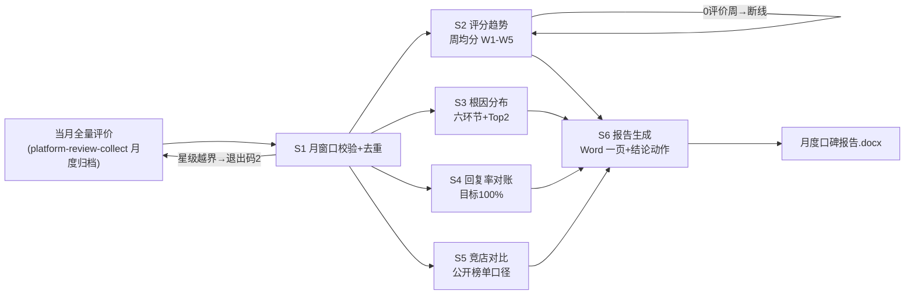

# 月度口碑报告

## 元信息

| 字段 | 值 |
|------|-----|
| ID | `de_local_02_wf05` |
| 类型 | **`composite`（复合技能 / T3 工作流）** |
| 所属员工 | 口碑捍卫者 |
| 阶段 | `P1` |
| 复杂度 | `S` |
| 触发方式 | 定时（每月 1 日） |
| ROI | 替代代运营月报（代运营 2000 元/月起） |
| 资产形态 | 编排提示词 + Python 编排脚本（无模型调用、无 API Key） |

## 能力描述

把一个月评价数据加工成一页老板周会可用的口碑月报：月窗口校验与去重 → **评分趋势**（周均分序列 W1-W5，0 评价周「无数据」断线不补零，全月 <10 条标注「样本量小」）→ **根因分布**（复用六环节词表，Top2 环节）→ **回复率对账**（差评回复率目标 100%，未回复差评 ID 缺口清单）→ **竞店对比**（本店 vs 同商圈公开榜单评分，标注追赶目标/对比优势）→ 模型写结论与**下月三个必改动作**（动作+指标+责任人）。**全部数值由 `scripts/run_flow.py` 计算，模型只解读与写动作。**

## 编排的原子技能

| # | 原子技能 | 在本流程中的角色 |
|---|---------|------|
| 1 | [平台评价采集](../../skills/platform-review-collect/) | 数据源：当月全量评价归档（每月 1 日导出） |
| 2 | [点评回复生成](../../skills/review-reply-generate/) | 回复率缺口补回动作的执行技能 |
| 3 | [差评应对话术库](../../skills/negative-review-script-lib/) | 根因分类树口径来源 |
| 4 | [回复合规审核](../../skills/reply-compliance-review/) | 报告内引述评价原文的脱敏自查 |

## 步骤链路（DAG）



## 步骤明细

| # | 步骤 | 执行者 | 输入 | 输出 | 失败处理 |
|---|------|---------|------|------|---------|
| 1 | 月窗口校验 | 脚本 | 评价数组 + 月份 | 合格月度数据集 | 星级越界退出码 2；窗口外显式剔除；基期缺失标注不编造 |
| 2 | 评分趋势 | 脚本 | 月度数据集 | 周均分序列+环比+折线图 | 0 评价周断线不补零；全月 <10 条标注样本量小 |
| 3 | 根因分布 | 脚本 | 差评子集 | 六环节分布+Top2 | 本月 0 差评写「0 差评」转好评运营建议 |
| 4 | 回复率对账 | 脚本 | 全量评价 | 回复率+缺口清单 | reply_status 缺失按「未回复」保守计入 |
| 5 | 竞店对比 | 脚本 | 竞店数组 | 差距表 | 竞店数据缺失标注「未提供」，不编造分数 |
| 6 | 报告生成 | 模型+人工 | 全部统计产物 | Word 一页报告 | 结论与数据冲突以脚本为准；动作无责任人降级为店主本人 |

## 输入规格

| 字段 | 类型 | 必填 | 说明 |
|------|------|------|------|
| `shop` | string | ⬜ | 门店名 |
| `month` | string | ⬜ | 报告月份（如 2026-09） |
| `last_month` | object | ⬜ | 上月基期 {月均分, 好评率, 差评数} |
| `competitors` | array | ⬜ | 竞店 [{shop, stars, review_count}]（公开榜单抄录） |
| `reviews` | array | ✅ | [{id, stars, text, review_time, reply_status}] |

## 输出规格

| 字段 | 类型 | 说明 |
|------|------|------|
| `summary` | object | 月均分 / 环比 / 好评率 / 差评回复率 / 根因 Top2 / 样本量提示 |
| `trend` / `causes` / `reply` / `competitors` | object | 趋势序列 / 根因分布 / 回复率缺口 / 竞店对比 |
| 产物 | 文件 | `out/月度口碑报告.docx`（六区块+内嵌趋势图）、`out/评分趋势.png`、`out/monthly_report.json` |

## 验收标准

- [ ] 每一步的技能资产齐全（SKILL.md / prompt.txt / schema.json）
- [ ] 步骤间输入输出字段可衔接（归档 → 校验 → 四路统计 → 报告）
- [ ] 数值与脚本输出一致，基期/竞店缺失区块如实标注
- [ ] 下月动作 ≤3 个且均可验收；报告带 AI 生成标识并经店主确认

## 使用步骤

### 方式一：带脚本（推荐，端到端）

```bash
python3 <WF_DIR>/scripts/run_flow.py --input input.json --outdir out
python3 <WF_DIR>/scripts/run_flow.py --demo        # 无输入也能看效果
```

### 方式二：纯对话编排

把 `prompt.txt` 全文粘贴为系统提示词 → 提供当月评价与竞店数据 → 按 DAG 逐步执行，
末步按 Word 模板汇总成一页报告（结论与动作由模型补写）。

### 平台编排

| 平台 | 编排方式 |
|------|---------|
| **Coze / 扣子** | 新建工作流 → 按步骤添加节点，每节点填对应技能 prompt.txt |
| **Dify** | Workflow → LLM 节点链按 DAG 连接，步骤 1-5 用代码节点调 run_flow.py 逻辑 |
| **WorkBuddy** | 新建 Skill 按步骤串联各技能提示词 |

## 边界（不做的事）

- ❌ 不编造基期与竞店数据——缺失就标注，环比与对比区块留白说明
- ❌ 不用手算替代脚本——趋势/分布/回复率一律以脚本输出为准
- ❌ 不把周均分断线画成 0 分——避免趋势图失真为「暴跌」
- ❌ 不写超过 3 个下月动作——3 个可验收动作 > 10 个口号
- ❌ 不拿单周波动下月度结论——全月 <10 条评价标注「样本量小」

## 调用示例

**输入**（`examples/input.json`）：陈记酸菜鱼 2026-09，14 条评价，上月基期 4.3 分，2 家竞店。

**输出**（脚本实跑，退出码 0）：月均分 3.21（环比 -25.2%）；好评率 50%；**差评回复率
仅 14%**（6 条缺口 ID 列出）；Top2 根因 = 等位与出餐（44%）/ 菜品质量；W1→W2 从 4.67
跌至 2.5；竞店均落后 1.29-1.39 分列为追赶目标。Word 报告 + 趋势图 + JSON 三件套落盘。

## 所属工作流

本资产为复合技能（工作流），是独立的端到端流程，不隶属于其他工作流。

## 合规声明

- 本技能输出为 **AI 辅助生成内容**，报告经店主确认后内部使用
- 竞店数据仅使用平台公开展示信息（榜单评分），不爬取、不使用内部数据
- 客户昵称与评价原文在报告中脱敏（保留差评 ID 可追溯）

---

*本复合技能遵循 [bangwozuo 数字员工资产规范](https://github.com/bangwozuo/digital-employee-spec) v3.0*
