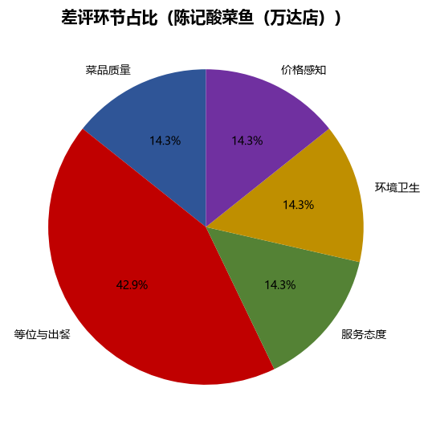
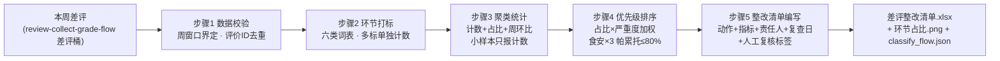

# 差评根因归类 Negative Review Classify Flow

> 复合技能（工作流） ｜ 属于「口碑捍卫者」 ｜ 本地生活商家客群 ｜ T3 编排型（脚本交付真实文件） ｜ 触发：定时（每周）
>
> **把一周的差评从「挨骂记录」变成「改进路线图」：环节打标、聚类统计、严重度加权排序，产出带责任人与观察指标的整改清单。**
> 5 步真实 DAG · 六环节词表打标（菜品/服务/等位/环境/价格/物流）· 严重度加权（食安 ×3、服务 ×2、菜品 ×2）· 帕累托 ≤80% 列「本周必改」· 小样本（<5 条）不下结论


🎬 **[▶ 观看演示视频（在线播放）](https://cdn.jsdelivr.net/gh/bangwozuo/review-firefighter-zh@main/workflows/negative-review-classify-flow/docs/assets/demo.mp4) · [GitHub 页](https://github.com/bangwozuo/review-firefighter-zh/blob/main/workflows/negative-review-classify-flow/docs/assets/demo.mp4)** — 四幕检测叙事：业务钩子 → 真实执行 → 检查项逐条亮灯 → 交付物

*上图来自真实执行：`python scripts/run_flow.py --input examples/input.json --outdir out`，10 条差评（窗口内 8、显式剔除 2）→ 等位与出餐 33.3% 列 P0，菜品质量仅 1 条但因食安 ×3 加权同样进必改，产物落盘 Excel + PNG + JSON。*

## 实跑产物

| 文件 | 说明 |
|---|---|
| [`out/差评整改清单.xlsx`](out/差评整改清单.xlsx) | 环节统计（P0 标红）+ 整改清单 + 待定性复核 + 汇总 |
|  | 六环节占比饼图（脚本自动生成） |
| `out/classify_flow.json` | 机器可读结果 |

## 它怎么归因（核心规则）

### 六环节词表（一条差评可打多标，多标 = 体验全面崩坏）

| 环节 | 典型命中词 |
|---|---|
| 菜品质量 | 难吃 / 异物 / 变质 / 分量 |
| 服务态度 | 爱答不理 / 呵斥 / 态度差 |
| 等位与出餐 | 等了 N 分钟 / 排队 / 催单 / 超时 |
| 环境卫生 | 脏 / 油腻 / 烟味 / 餐具不洁 |
| 价格感知 | 贵 / 不值 / 涨价 |
| 物流配送 | 外卖超时 / 撒漏 / 漏送 |

### 优先级 = 环节占比 × 严重度权重

| 权重 | 适用 | 效果 |
|---|---|---|
| ×3 | 食安相关（命中异物/变质/中毒词） | 1 条食安 > 5 条等位 |
| ×2 | 服务质量 / 菜品 | — |
| ×1 | 其他环节 | — |

按帕累托法则取累计占比 ≤80% 的环节列「本周必改」，其余「持续观察」。**统计纪律**：样本 <5 条的环节环比只报计数不下结论；窗口外数据显式剔除并计数；六类全未命中归「待定性」人工回写标签库。

## 真实输入 → 真实输出

**输入**（`examples/input.json`，节选）：

```json
{"week_start": "2026-09-21", "last_week": {"菜品质量": 3, "等位与出餐": 5, "...": "..."},
 "reviews": [
   {"id": "M-2201", "text": "鱼汤里有头发丝", "stars": 1},
   {"id": "M-2202", "text": "等了45分钟才上菜，还上错菜", "stars": 2},
   {"id": "P-3312", "text": "这条是上周五的老差评补录", "stars": 2}
 ]}
```

**输出**（脚本实跑，环节统计表节选）：

| 环节 | 本周 | 上周 | 环比 | 占比 | 优先级 |
|---|---|---|---|---|---|
| 等位与出餐 | 3 | 5 | -40% | 33.3% | P0 必改 |
| 菜品质量 | 1 | 3 | 小样本，不下结论 | 11.1% | P0 必改（食安 ×3） |
| 服务态度 | 1 | 1 | 小样本，不下结论 | 11.1% | P0 必改 |
| 待定性 | 2 | — | 基期缺失 | 22.2% | 持续观察 |
| 物流配送 | 0 | 1 | 小样本，不下结论 | 0.0% | — |

关键判定：菜品质量仅 1 条（鱼汤异物），但因食安 ×3 加权超过占 33% 的等位环节；窗口外 2 条（9-19 老差评、9-28 下周一差评）显式剔除不混入。整改清单由脚本出骨架、模型按步骤 5 补写可验收动作（如「出餐前增加双人目检」而非「加强管理」）。完整统计与整改清单见 [`examples/output.md`](examples/output.md)。

## 处理流水线



## 快速开始

**方式一：脚本（推荐，计数/占比/优先级以脚本为准）**

```bash
# 演示模式（内置真实样例）
python scripts/run_flow.py --demo
# 指定输入
python scripts/run_flow.py --input examples/input.json --outdir out
```

**方式二：纯对话**

```text
1. 打开 prompt.txt，全文复制
2. 粘贴到 Coze / WorkBuddy / Dify / Claude / ChatGPT
3. 按 schema.json 提供：差评数组 + 周期起止日 + 上周环节计数（可选）
```

失败处理：全部环节都是「待定性」→ 判定「词表覆盖不足」，输出「先补标签库再谈整改」，不硬排优先级；整改动作与门店资源不匹配 → 降级为可执行的最小动作。

## 面向谁 / 什么时候用

| ✅ 该用 | ❌ 别用 |
|---|---|
| 每周把差评变成带责任人、观察指标、复查日的整改清单（把「挨骂」变成「改进路线图」） | 写不可验收的整改：「加强培训」「提升意识」一律不合格 |
| 用严重度加权排序：1 条食安差评 > 5 条等位差评 | 拿差评数直接当优先级（必须过严重度加权） |
| 识别词表覆盖不足（待定性过多 → 先补标签库） | 跨周混合统计——窗口外数据剔除并显式计数，不混入 |

## 边界与合规

- 本资产输出为 **AI 辅助生成内容**；整改清单供内部经营改进，不对外发布
- 差评原文含客户昵称时保留平台展示原样，整改清单不外传
- 涉及食安的环节同步提示法务与平台报备义务

## 文件地图

```text
├── README.md                ← 本文件
├── SKILL.md                 ← 资产定义（元信息 / 契约 / 边界）
├── prompt.txt               ← 提示词本体（5 步分步指令 + DAG + 禁止项）
├── schema.json              ← 输入输出契约（机器可读）
├── scripts/run_flow.py      ← 确定性编排脚本（打标 → 聚类 → 加权排序）
├── examples/                ← 真实输入 + 脚本实跑输出
├── docs/                    ← 9 项配套文档（架构 / 流程 / 场景 / 测试报告…）
└── out/                     ← 实跑产物（差评整改清单.xlsx / 环节占比.png / classify_flow.json）
```

**编排关系**：消费 [review-collect-grade-flow](../review-collect-grade-flow/) 的差评桶；话术复用 [negative-review-script-lib](../../skills/negative-review-script-lib/)；六环节词表被 [monthly-reputation-report-flow](../monthly-reputation-report-flow/) 复用。

---

*本资产遵循 [bangwozuo 数字员工资产规范](https://github.com/bangwozuo/digital-employee-spec) v3.0 ｜ [所属员工：口碑捍卫者](../../) ｜ [总入口](https://github.com/bangwozuo/digital-employees-hub-zh)*
