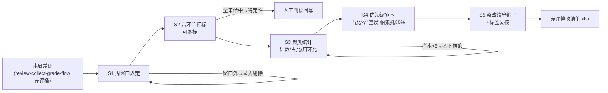

# 差评根因归类

## 元信息

| 字段 | 值 |
|------|-----|
| ID | `de_local_02_wf04` |
| 类型 | **`composite`（复合技能 / T3 工作流）** |
| 所属员工 | 口碑捍卫者 |
| 阶段 | `P0` |
| 复杂度 | `S` |
| 触发方式 | 定时（每周一快照上周差评） |
| ROI | 把"挨骂"变成"改进路线图" |
| 资产形态 | 编排提示词 + Python 编排脚本（无模型调用、无 API Key） |

## 能力描述

把一周差评变成可验收的整改路线图：周窗口界定（窗口外显式剔除）→ **六环节打标**（菜品质量 / 服务态度 / 等位与出餐 / 环境卫生 / 价格感知 / 物流配送词表，可多标，全未命中归「待定性」人工判读）→ 聚类统计（计数 / 占比 / 周环比；**样本 <5 条只报计数不下结论**）→ **优先级排序**（占比 × 严重度加权：食安命中 ×3、菜品与服务 ×2，帕累托加权累计 ≤80% 列「本周必改」）→ 模型编写整改清单（可验收动作 + 责任人 + 观察指标 + 复查日）。**打标、统计、优先级由 `scripts/run_flow.py` 计算，模型只写整改动作与复核标签。**

## 编排的原子技能

| # | 原子技能 | 在本流程中的角色 |
|---|---------|------|
| 1 | [差评应对话术库](../../skills/negative-review-script-lib/) | 根因分类树与整改方向的规则来源（质量>服务>物流>期望差>价格） |

## 步骤链路（DAG）



## 步骤明细

| # | 步骤 | 执行者 | 输入 | 输出 | 失败处理 |
|---|------|---------|------|------|---------|
| 1 | 周窗口界定 | 脚本 | 差评数组 + 周起始日 | 窗口内差评集 | 窗口外剔除并显式计数；text 为空归「待定性」不猜标签 |
| 2 | 环节打标 | 脚本 | 窗口内差评 | 每条标签集 | 六类全未命中归「待定性」，模型人工判读后回写 |
| 3 | 聚类统计 | 脚本 | 标签集 | 环节计数表 | 桶为 0 显式写 0；样本 <5 环比不下结论；基期缺失标注 |
| 4 | 优先级排序 | 脚本 | 统计表 | P0 必改 / 持续观察 | 食安命中权重 ×3；全待定性则输出「先补标签库」不硬排 |
| 5 | 整改清单 | 模型+人工 | 优先级表 + 原文 | 可验收整改项 | 动作不可验收（「加强管理」）必须重写；资源不匹配降级为最小动作 |

## 输入规格

| 字段 | 类型 | 必填 | 说明 |
|------|------|------|------|
| `shop` | string | ⬜ | 门店名 |
| `week_start` | string | ⬜ | 周期起始日（ISO） |
| `last_week` | object | ⬜ | 上周各环节计数（算周环比） |
| `reviews` | array | ✅ | [{id, text, stars, review_time, order_amount}] |

## 输出规格

| 字段 | 类型 | 说明 |
|------|------|------|
| `summary` | object | 窗口内差评数 / 必改环节 / 食安相关数 / 多标差评数 |
| `stat` | array | 环节统计表（本周 / 上周 / 环比 / 占比 / 优先级） |
| `todo` | array | 整改清单（环节 / 可验收动作 / 责任人 / 观察指标 / 复查日） |
| 产物 | 文件 | `out/差评整改清单.xlsx`（P0 标红）、`out/环节占比.png`、`out/classify_flow.json` |

## 验收标准

- [ ] 每一步的技能资产齐全（SKILL.md / prompt.txt / schema.json）
- [ ] 步骤间输入输出字段可衔接（差评桶 → 打标 → 统计 → 优先级 → 整改清单）
- [ ] 食安相关差评无论占比多小都进必改
- [ ] 整改动作全部可验收（含动作 + 指标 + 责任人），无「加强管理」类空话

## 使用步骤

### 方式一：带脚本（推荐，端到端）

```bash
python3 <WF_DIR>/scripts/run_flow.py --input input.json --outdir out
python3 <WF_DIR>/scripts/run_flow.py --demo        # 无输入也能看效果
```

### 方式二：纯对话编排

把 `prompt.txt` 全文粘贴为系统提示词 → 提供本周差评 → 按 DAG 逐步执行，
末步产出整改清单（整改动作部分由模型补写）。

### 平台编排

| 平台 | 编排方式 |
|------|---------|
| **Coze / 扣子** | 新建工作流 → 按步骤添加节点，每节点填对应技能 prompt.txt |
| **Dify** | Workflow → LLM 节点链按 DAG 连接，步骤 1-4 用代码节点调 run_flow.py 逻辑 |
| **WorkBuddy** | 新建 Skill 按步骤串联各技能提示词 |

## 边界（不做的事）

- ❌ 不写不可验收的整改——「加强培训」「提升意识」一律不合格
- ❌ 不用小样本下结论——环节样本 <5 条不做环比结论
- ❌ 不掩盖食安——异物/变质/中毒类权重 ×3，无论占比多小都进必改
- ❌ 不跨周混合统计——窗口外数据剔除并显式计数
- ❌ 不拿差评数直接当优先级——必须过严重度加权

## 调用示例

**输入**（`examples/input.json`）：陈记酸菜鱼 9-21 周差评 10 条（含 2 条窗口外），上周基期数据。

**输出**（脚本实跑，退出码 0）：窗口内 8 条；等位与出餐 3 条（-40% 环比）P0；
菜品质量仅 1 条但因食安 ×3 进 P0 且排位第一；环境卫生 / 价格感知 1 条列持续观察；
待定性 2 条转人工判读（含「期望差」类词表未覆盖项）。

## 所属工作流

本资产为复合技能（工作流），是独立的端到端流程，不隶属于其他工作流。

## 合规声明

- 本技能输出为 **AI 辅助生成内容**，整改清单供内部经营改进，不对外发布
- 差评原文客户昵称保持平台展示原样，清单不外传
- 涉及食安的环节同步提示法务与平台报备义务

---

*本复合技能遵循 [bangwozuo 数字员工资产规范](https://github.com/bangwozuo/digital-employee-spec) v3.0*
