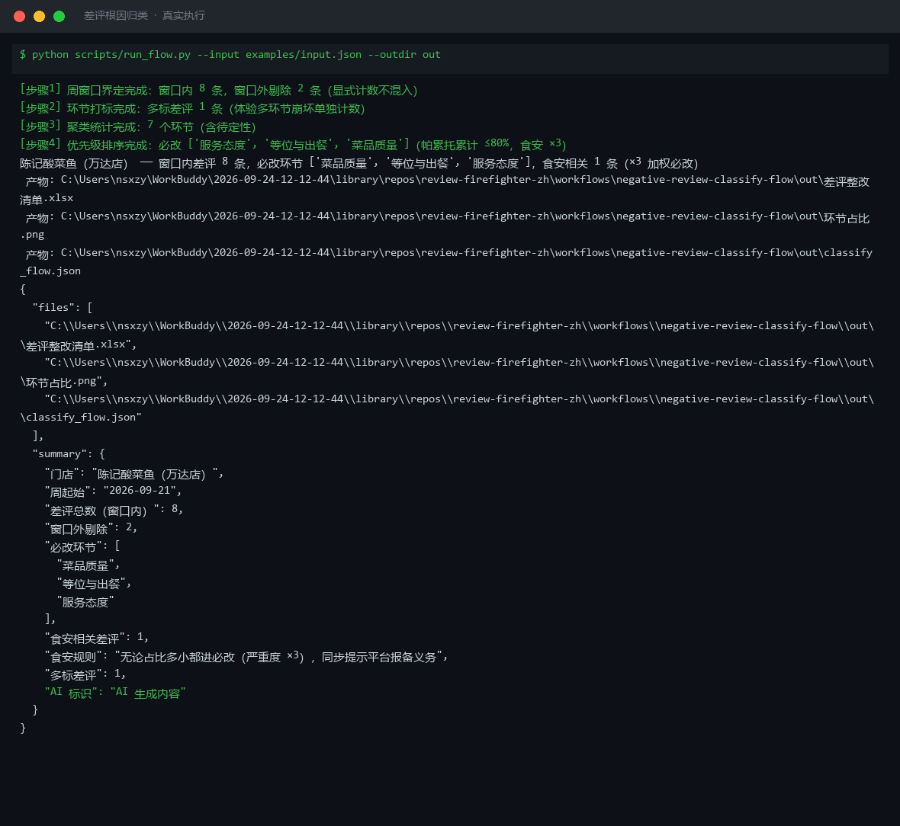

# 截图与录屏

> 以下素材均来自**真实执行**：`--run` 实拍终端 / 实跑产物文件，无摆拍。

## 演示视频


*Hyperframes 动态渲染 15s：命令逐字敲入（光标闪烁）→ 21 行真实输出逐行流式 → 实跑产物 Ken Burns 缓推*

## 执行截图



## 实跑产物

| 文件 | 说明 |
|---|---|
| [`out/classify_flow.json`](out/classify_flow.json) | 结构化结果（实跑生成） · 3 KB |
| [`out/差评整改清单.xlsx`](out/差评整改清单.xlsx) | Excel 工作簿（实跑生成） · 8 KB |
| [`out/环节占比.png`](out/环节占比.png) | 图表产物（实跑生成） · 35 KB |


---

## 附录：实跑输出明细

> 本资产为纯提示词客户端资产，无界面可截图。以下为**实跑运行效果**。

## 运行效果

### 输入

```json
{
  "input": "请提供工作流的初始输入数据"
}

```

### 输出

## 执行摘要

当前输入为占位提示，缺少工作流所需的初始数据，无法继续执行。

## 分步结果

1. 步骤 1（差评应对话术库）：**未执行** — 缺少待归类的差评内容列表

## 最终交付物

请补充以下信息后再重新执行：

- 待归类的差评原文列表（至少包含评价内容、评分、平台来源）
- 所属行业（餐饮 / 酒店 / 零售等，影响根因分类维度）
- 期望输出格式（如是否需要输出整改清单模板）

---
*本内容系 AI 生成，仅供参考。*


---

*运行效果由实跑验证生成*
