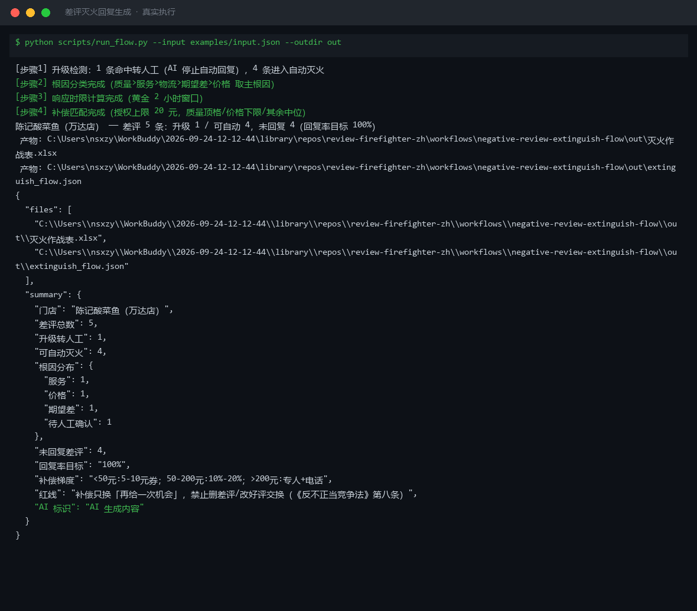
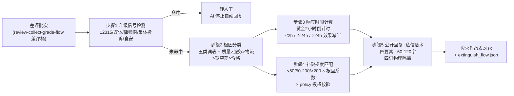

# 差评灭火回复生成 Negative Review Extinguish Flow

> 复合技能（工作流） ｜ 属于「口碑捍卫者」 ｜ 本地生活商家客群 ｜ T3 编排型（脚本交付真实文件） ｜ 触发：事件（新差评）→ 即时推送预警
>
> **把每条差评变成一套完整灭火方案：根因判定 → 响应时限 → 梯度内补偿 → 公开回复 + 私信话术，升级信号命中即停。**
> 5 步真实 DAG · 升级信号最高优先级（12315/媒体/律师函/集体投诉/食安命中即停）· 五类根因词表 + 优先序 · 2 小时黄金窗口倒计时 · 3 档补偿梯度 × 授权校验



🎬 **[▶ 观看演示视频](docs/assets/demo.mp4)** — 四幕创作叙事：业务钩子 → 真实执行 → 要点到成稿演变 → 交付物

*上图来自真实执行：`python scripts/run_flow.py --input examples/input.json --outdir out`，5 条差评 → 升级 1（「鱼汤里有头发丝，已经打12315了」）/ 可自动 4，根因逐条判定，补偿全部落在授权口径（单笔上限 20 元）内，产物落盘 Excel + JSON。*

## 实跑产物

| 文件 | 说明 |
|---|---|
| [`out/灭火作战表.xlsx`](out/灭火作战表.xlsx) | 作战表（质量根因/超授权标红）+ 升级清单（12315 标红）+ 汇总 |
| `out/extinguish_flow.json` | 机器可读结果 |

## 它怎么灭火（核心规则）

### 步骤 1（最高优先级）：升级信号检测

差评中出现 **12315 / 媒体曝光 / 律师函 / 集体投诉 / 食物中毒（含拉肚子、异物等食安词）** 任一字样 → 该条打「转人工」标，**跳过后续所有自动步骤**，只产出人工处置建议（留存证据、2 小时内电话联系、向平台报备）。

### 五类根因词表（多重命中按优先序取主根因）

| 优先序 | 根因 | 典型命中词 | 补偿倾向 |
|---|---|---|---|
| 1 | 质量 | 色差 / 故障 / 过期 / 异物 | 退款优先（顶格） |
| 2 | 服务 | 态度 / 等待 / 上错菜 | 当次折扣 |
| 3 | 物流 | 破损 / 超时 / 丢件 | 运费补偿 |
| 4 | 期望差 | 图片与实物不符 / 描述夸大 | 差价退还 |
| 5 | 价格 | 不值 / 分量少 / 涨价 | 券拉复购（取下限） |

### 补偿梯度 × 授权校验

| 订单金额 | 梯度 | 规则 |
|---|---|---|
| < 50 元 | 5-10 元券 | 私信轻补 |
| 50-200 元 | 订单额 10%-20% 的券或退款 | 私信给具体金额与有效期 |
| > 200 元 | 专人对接 + 电话沟通 | 不在线上承诺金额 |

超授权（policy 口径）一律标红待人工；order_amount 缺失 → 标「金额待补」不发券；恶意差评嫌疑（无订单记录）→ 不给补偿，转平台申诉要点。

**红线**：私信话术只谈解决方案与「欢迎再给一次机会」，**全文不得出现「评价/好评/差评/删」四词**（补偿与评价物理隔离，触《反不正当竞争法》第八条）。

## 真实输入 → 真实输出

**输入**（`examples/input.json`，节选）：

```json
{"id": "M-2202", "text": "等了45分钟才上菜，孩子都饿哭了，上错菜一次", "order_amount": 34},
{"id": "M-2201", "text": "鱼汤里有头发丝，已经打12315了", "order_amount": 128}
```

**输出**（脚本实跑，灭火作战表节选）：

| 评价ID | 平台 | 主根因 | 命中证据 | 响应档位 | 补偿方案 | 授权校验 | 处置 |
|---|---|---|---|---|---|---|---|
| M-2202 | 美团 | 服务 | 服务:上错菜 | ≤2 小时（黄金窗口） | 满 44 减 7 券（梯度 5-10 元） | ✅ | 转四要素成稿 |
| P-3308 | 点评 | 期望差 | 期望差:图片和实物 | 2-24 小时 | 满 114 减 13 券（梯度 9-18 元） | ✅ | 转四要素成稿 |
| D-1105 | 抖音 | 待人工确认 | 五类词表未命中（纯情绪） | 2-24 小时 | 金额待补：不发券，先私信了解情况 | — | 转四要素成稿 |

**升级清单（AI 停止自动回复）**：M-2201 ｜ 触发信号：12315、头发丝 ｜ 人工动作：留存证据；2 小时内电话联系；向平台报备。

模型步骤 5 成稿示例（M-2202，公开回复 92 字，私信四词检查通过）：

> 看到您反馈的 45 分钟等位和上错菜问题，很抱歉让一家人等急了。门店已改用双人传菜并在出餐前增加菜品核对。给您添的麻烦请私信店长，我们核实后处理。

完整作战表与批次汇总见 [`examples/output.md`](examples/output.md)。

## 处理流水线



## 快速开始

**方式一：脚本（推荐，根因/时限/补偿金额以脚本为准）**

```bash
# 演示模式（内置真实样例）
python scripts/run_flow.py --demo
# 指定输入
python scripts/run_flow.py --input examples/input.json --outdir out
```

**方式二：纯对话**

```text
1. 打开 prompt.txt，全文复制
2. 粘贴到 Coze / WorkBuddy / Dify / Claude / ChatGPT
3. 按 schema.json 提供：差评数组 + 补偿授权口径（policy）+ 当前时间
```

失败处理：根因五类全未命中（纯情绪「再也不来了」）→ 标「待人工确认」不给金额；整改动作未经店主确认 → 公开回复中该句降级为「正在核实」。

## 面向谁 / 什么时候用

| ✅ 该用 | ❌ 别用 |
|---|---|
| 新差评即时预警 + 2 小时黄金窗口响应（评分掉 0.3 分=客流少两成，单次挽损千元级） | 碰升级信号——12315/媒体/律师函命中即停，AI 不出任何自动回复 |
| 补偿方案拿不准时，按梯度 × 授权口径自动核算 | 做删差评交换：「改好评返现/删差评送菜」违反平台规则与《反不正当竞争法》第八条 |
| 公开回复四要素 + 私信话术一次成稿 | 在公开区承诺退款金额（金额只出现在私信与电话） |

## 边界与合规

- 本资产输出为 **AI 辅助生成内容**；发布前经店主确认 + [reply-compliance-review](../../skills/reply-compliance-review/) 口径自查
- 补偿涉及资金仅出方案草稿；**>200 元订单的沟通必须人工执行**
- 食安事件人工与法务优先；平台评价规范以美团/点评/抖音官方最新公示为准

## 文件地图

```text
├── README.md                ← 本文件
├── SKILL.md                 ← 资产定义（元信息 / 契约 / 边界）
├── prompt.txt               ← 提示词本体（5 步分步指令 + DAG + 禁止项）
├── schema.json              ← 输入输出契约（机器可读）
├── scripts/run_flow.py      ← 确定性编排脚本（升级检测 → 根因 → 时限 → 补偿梯度）
├── examples/                ← 真实输入 + 脚本实跑输出
├── docs/                    ← 9 项配套文档（架构 / 流程 / 场景 / 测试报告…）
└── out/                     ← 实跑产物（灭火作战表.xlsx / extinguish_flow.json）
```

**编排关系**：消费 [review-collect-grade-flow](../review-collect-grade-flow/) 的差评桶；话术复用 [review-reply-generate](../../skills/review-reply-generate/) 与 [negative-review-script-lib](../../skills/negative-review-script-lib/)。

---

*本资产遵循 [bangwozuo 数字员工资产规范](https://github.com/bangwozuo/digital-employee-spec) v3.0 ｜ [所属员工：口碑捍卫者](../../) ｜ [总入口](https://github.com/bangwozuo/digital-employees-hub-zh)*
