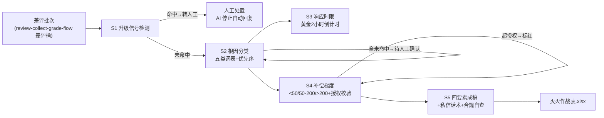

# 差评灭火回复生成

## 元信息

| 字段 | 值 |
|------|-----|
| ID | `de_local_02_wf03` |
| 类型 | **`composite`（复合技能 / T3 工作流）** |
| 所属员工 | 口碑捍卫者 |
| 阶段 | `P0` |
| 复杂度 | `S` |
| 触发方式 | 事件（新差评）→ 即时推送预警 |
| ROI | 评分掉 0.3 分=客流少两成（据 R4 调研），单次挽损千元级 |
| 资产形态 | 编排提示词 + Python 编排脚本（无模型调用、无 API Key） |

## 能力描述

把每条差评加工成完整灭火方案：**升级信号检测**（12315 / 媒体曝光 / 律师函 / 集体投诉 /食安词命中即转人工，AI 停止自动回复，最高优先级）→ **根因分类**（物流/质量/期望差/服务/价格五类词表，多重命中按「质量>服务>物流>期望差>价格」取主根因）→ **响应时限**（差评出现后 2 小时黄金窗口倒计时，>24 小时标注效果减半）→ **补偿梯度匹配**（<50 元补 5-10 元券；50-200 元补订单额 10%-20%；>200 元专人对接+电话；质量类顶格、价格类下限、超授权标红）→ 模型撰写四要素公开回复（60-120 字）与私信话术（补偿与评价物理隔离）。**根因、时限、补偿金额由 `scripts/run_flow.py` 计算，模型只写成稿。**

## 编排的原子技能

| # | 原子技能 | 在本流程中的角色 |
|---|---------|------|
| 1 | [点评回复生成](../../skills/review-reply-generate/) | 步骤 5 公开回复的撰写方法（四要素、60-120 字） |
| 2 | [差评应对话术库](../../skills/negative-review-script-lib/) | 步骤 4/5 补偿梯度与私信话术的规则来源 |
| 3 | [回复合规审核](../../skills/reply-compliance-review/) | 步骤 5 发布前红线自查（四词排除、授权核对） |

## 步骤链路（DAG）



## 步骤明细

| # | 步骤 | 执行者 | 输入 | 输出 | 失败处理 |
|---|------|---------|------|------|---------|
| 1 | 升级信号检测 | 脚本 | 差评数组 | 升级清单 + 可自动批次 | 命中即转人工跳过自动步骤；食安类无订单号按无法核实并入人工 |
| 2 | 根因分类 | 脚本 | 可自动批次 | 主/次根因+证据 | 五类全未命中标「待人工确认」，补偿不给金额 |
| 3 | 响应时限 | 脚本 | 带根因批次 | 响应档位 | review_time 缺失按「立即响应」并标注，不按 24 小时后估算 |
| 4 | 补偿梯度 | 脚本 | 带时限批次 | 补偿方案+授权校验 | order_amount 缺失标「金额待补」不发券；恶意嫌疑转申诉；超授权标红 |
| 5 | 成稿与自查 | 模型+人工 | 作战表 | 公开回复+私信话术 | 整改动作未确认降级「正在核实」；店主砍补偿则删金额句 |

## 输入规格

| 字段 | 类型 | 必填 | 说明 |
|------|------|------|------|
| `shop` | string | ⬜ | 门店名 |
| `policy` | string | ⬜ | 补偿授权口径（如「单笔上限 20 元」） |
| `now` | string | ⬜ | 当前时间（ISO），用于倒计时 |
| `reviews` | array | ✅ | [{id, platform, text, order_amount, review_time, reply_status, order_id}] |

## 输出规格

| 字段 | 类型 | 说明 |
|------|------|------|
| `summary` | object | 差评数 / 升级数 / 根因分布 / 未回复数 / 补偿梯度与红线 |
| `items` | array | 灭火作战表（主/次根因 / 响应档位 / 补偿方案 / 授权校验 / 处置） |
| `escalated` | array | 升级清单（触发信号 + 人工动作） |
| 产物 | 文件 | `out/灭火作战表.xlsx`、`out/extinguish_flow.json` |

## 验收标准

- [ ] 每一步的技能资产齐全（SKILL.md / prompt.txt / schema.json）
- [ ] 步骤间输入输出字段可衔接（差评桶 → 升级检测 → 根因 → 时限 → 补偿 → 成稿）
- [ ] 升级信号命中 100% 转人工，AI 零自动回复
- [ ] 补偿全部落在梯度内且过授权校验；私信话术通过四词排除检查

## 使用步骤

### 方式一：带脚本（推荐，端到端）

```bash
python3 <WF_DIR>/scripts/run_flow.py --input input.json --outdir out
python3 <WF_DIR>/scripts/run_flow.py --demo        # 无输入也能看效果
```

### 方式二：纯对话编排

把 `prompt.txt` 全文粘贴为系统提示词 → 提供差评数据 → 按 DAG 逐步执行，
末步产出灭火作战表（成稿部分由模型补全）。

### 平台编排

| 平台 | 编排方式 |
|------|---------|
| **Coze / 扣子** | 新建工作流 → 按步骤添加节点，每节点填对应技能 prompt.txt |
| **Dify** | Workflow → LLM 节点链按 DAG 连接，步骤 1-4 用代码节点调 run_flow.py 逻辑 |
| **WorkBuddy** | 新建 Skill 按步骤串联各技能提示词 |

## 边界（不做的事）

- ❌ 不碰升级信号——命中即停，AI 不出任何自动回复
- ❌ 不做删差评交换——补偿只换「再给一次机会」，违规表述一律不生成
- ❌ 不发超梯度补偿——金额落出梯度或超授权标红待人工
- ❌ 不在公开区承诺退款金额
- ❌ 不编造整改动作——未经确认写「正在核实」

## 调用示例

**输入**（`examples/input.json`）：陈记酸菜鱼，5 条差评（含 12315 升级 1 条、无金额 1 条）。

**输出**（脚本实跑，退出码 0）：升级 1 条（12315+头发丝）转人工；可自动 4 条 ——
服务根因 34 元订单补 7 元券（≤2h 黄金窗口）、期望差 88 元补 13 元券、价格 26 元补
5 元券（下限）、纯情绪 1 条待人工确认不给金额；全部过授权校验（上限 20 元）。

## 所属工作流

本资产为复合技能（工作流），是独立的端到端流程，不隶属于其他工作流。

## 合规声明

- 本技能输出为 **AI 辅助生成内容**，发布前经店主确认 + reply-compliance-review 口径自查
- 补偿涉及资金仅出方案草稿；>200 元订单沟通必须人工执行
- 平台评价规范以官方最新公示为准；食安事件人工与法务优先

---

*本复合技能遵循 [bangwozuo 数字员工资产规范](https://github.com/bangwozuo/digital-employee-spec) v3.0*
