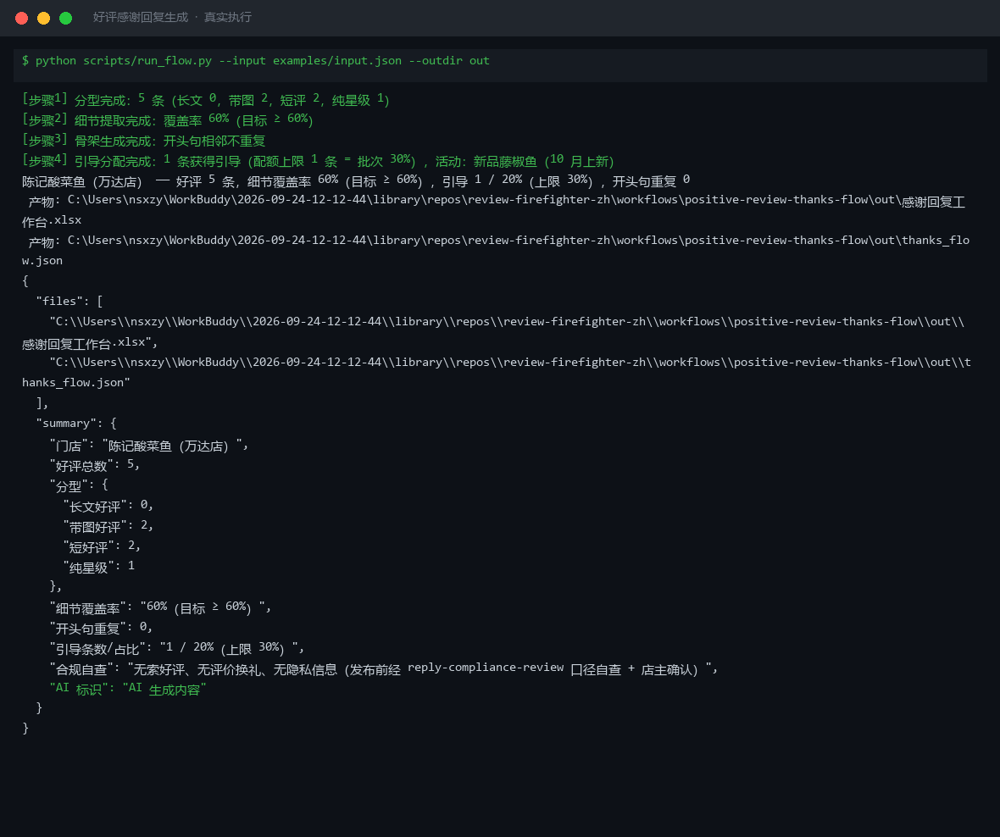
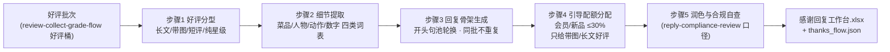

# 好评感谢回复生成 Positive Review Thanks Flow

> 复合技能（工作流） ｜ 属于「口碑捍卫者」 ｜ 本地生活商家客群 ｜ T3 编排型（脚本交付真实文件） ｜ 触发：事件（新好评）
>
> **把好评批次加工成一组「每条都不重样」的感谢回复：细节提取、开头句去重、引导配额全部由脚本保证。**
> 5 步真实 DAG · 好评四分型（长文/带图/短评/纯星级）· 开头句池 ≥8 句同批不重复 · 轻引导配额 ≤30% 且只给带图/长文好评 · 细节覆盖率目标 ≥60%



🎬 **[▶ 观看演示视频](docs/assets/demo.mp4)** — 四幕创作叙事：业务钩子 → 真实执行 → 要点到成稿演变 → 交付物

*上图来自真实执行：`python scripts/run_flow.py --input examples/input.json --outdir out`，5 条好评 → 带图 2 / 短评 2 / 纯星级 1，细节覆盖率 60%（达标），引导 1 条占 20%（上限 30%），开头句重复 0，产物落盘 Excel + JSON。*

## 实跑产物

| 文件 | 说明 |
|---|---|
| [`out/感谢回复工作台.xlsx`](out/感谢回复工作台.xlsx) | 工作台（纯星级行标黄提示）+ 汇总 |
| `out/thanks_flow.json` | 机器可读结果 |

## 它怎么写（核心规则）

### 好评四分型（分型决定处理优先级）

| 分型 | 判定 | 特点 |
|---|---|---|
| 长文好评 | ≥40 字 | 信息量最大，优先处理 |
| 带图好评 | has_image | 转化价值高，是轻引导的唯一对象（与长文一起） |
| 短好评 | <40 字 | 只做细节致谢，不引导 |
| 纯星级 | 无文字 | 标「简版」，短回复，**不虚构细节** |

### 三条硬规则（脚本保证）

| 规则 | 数值 | 说明 |
|---|---|---|
| 细节覆盖率 | 目标 ≥ 60% | 四类词表扫描：菜品 / 人物 / 动作 / 数字；一条未命中 → 简短致谢并归低优先级，禁止编造 |
| 开头句重复 | 0 | 开头句池 ≥8 句轮换（「谢谢您…」「被您夸…」「您的认可…」「又见面啦…」），相邻两条必不同 |
| 轻引导占比 | ≤ 30% | 只分配给带图好评与长文好评；不得设交换条件（「评价送菜」属违规） |

## 真实输入 → 真实输出

**输入**（`examples/input.json`，节选）：

```json
{"id": "D-1104", "platform": "抖音", "stars": 4, "text": "酸菜很正，鱼片嫩，下次还来", "has_image": true},
{"id": "M-2204", "platform": "美团", "stars": 5, "text": "好吃！", "has_image": false}
```

**输出**（脚本实跑，感谢回复工作台节选）：

| 评价ID | 分型 | 提取细节 | 开头句 | 回复骨架 | 轻引导 | 发布 |
|---|---|---|---|---|---|---|
| D-1104 | 带图好评 | 菜品:酸菜/鱼片 | 谢谢您记得 | 谢谢您记得！您提到的酸菜和鱼片我们都记下了…… | 新品藤椒鱼（10 月上新） | 待店主确认 |
| M-2203 | 带图好评 | 菜品:小菜；人物:小陈；动作:分鱼 | 您的认可 | 您的认可！小陈的分鱼服务我们都记下了…… | （不引导） | 待店主确认 |
| M-2204 | 短好评 | （无细节，短回复） | 又见面啦 | 又见面啦！您的鼓励我们记下了，期待下次用味道让您写满整条评价。 | （不引导） | 待店主确认 |
| P-3307 | 纯星级 | （无细节，短回复） | 这波夸奖 | 这波夸奖您的五星好评！欢迎把想吃的菜告诉我们。 | （不引导） | 待店主确认 |

完整 5 条与批次汇总见 [`examples/output.md`](examples/output.md)；骨架中的「菜品:酸菜/鱼片」等标记由模型在步骤 5 润色为自然语句，细节引用不可丢失。

## 处理流水线



## 快速开始

**方式一：脚本（推荐，数值与去重以脚本为准）**

```bash
# 演示模式（内置真实样例）
python scripts/run_flow.py --demo
# 指定输入
python scripts/run_flow.py --input examples/input.json --outdir out
```

**方式二：纯对话**

```text
1. 打开 prompt.txt，全文复制
2. 粘贴到 Coze / WorkBuddy / Dify / Claude / ChatGPT
3. 按 schema.json 提供：好评数组（id/platform/stars/text/has_image）+ 活动上下文
```

失败处理：stars < 4 混入 → 退回分级流程（本流不处理差评）；无进行中活动 → 引导配额自然落空，全部输出纯感谢，不硬凑。

## 面向谁 / 什么时候用

| ✅ 该用 | ❌ 别用 |
|---|---|
| 好评批量回复，要每条不重样、引用评价细节（每条省 5 分钟，月 100 条 ≈ 8 小时） | 索好评：「麻烦给个好评」「追评有礼」一律禁止——平台处罚 +《反不正当竞争法》 |
| 新品 / 会员日活动想借好评做轻引导 | 每条都带广告——引导占比 >30% 或短好评带引导即为过度营销 |
| 纯星级 / 「好吃！」这类无细节评价的诚实短回复 | 编造细节与荣誉——没点过「酸菜鱼」就不写「您喜爱的酸菜鱼」 |

## 边界与合规

- 本资产输出为 **AI 辅助生成内容**；成稿润色由模型完成，发布前经店主批量确认
- 引导活动必须真实存在且表述与活动规则一致
- 回复不出现其他客户信息，不泄露订单可识别字段；字数 50-100，超长反而刻意

## 文件地图

```text
├── README.md                ← 本文件
├── SKILL.md                 ← 资产定义（元信息 / 契约 / 边界）
├── prompt.txt               ← 提示词本体（5 步分步指令 + DAG + 禁止项）
├── schema.json              ← 输入输出契约（机器可读）
├── scripts/run_flow.py      ← 确定性编排脚本（分型 → 细节提取 → 开头句去重 → 引导配额）
├── examples/                ← 真实输入 + 脚本实跑输出
├── docs/                    ← 9 项配套文档（架构 / 流程 / 场景 / 测试报告…）
└── out/                     ← 实跑产物（感谢回复工作台.xlsx / thanks_flow.json）
```

**编排关系**：消费 [review-collect-grade-flow](../review-collect-grade-flow/) 的好评桶；合规口径复用 [reply-compliance-review](../../skills/reply-compliance-review/)。

---

*本资产遵循 [bangwozuo 数字员工资产规范](https://github.com/bangwozuo/digital-employee-spec) v3.0 ｜ [所属员工：口碑捍卫者](../../) ｜ [总入口](https://github.com/bangwozuo/digital-employees-hub-zh)*
