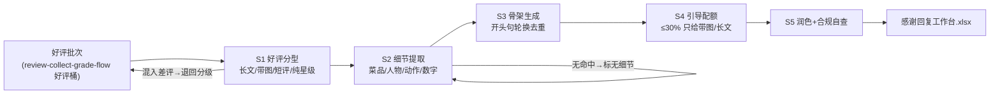

# 好评感谢回复生成

## 元信息

| 字段 | 值 |
|------|-----|
| ID | `de_local_02_wf02` |
| 类型 | **`composite`（复合技能 / T3 工作流）** |
| 所属员工 | 口碑捍卫者 |
| 阶段 | `P0` |
| 复杂度 | `S` |
| 触发方式 | 事件（新好评，经分级流程好评桶转入） |
| 资产形态 | 编排提示词 + Python 编排脚本（无模型调用、无 API Key） |

## 能力描述

把好评批次加工成「每条都不重样」的感谢回复工作台：好评分型（长文 / 带图 / 短评 / 纯星级，混入差评即退出码 2 退回分级流程）→ 细节提取（**菜品 / 人物 / 动作 / 数字四类词表**，无命中标「无细节」、禁止编造）→ 回复骨架生成（**开头句池轮换，同批相邻不重复**）→ 引导配额分配（轻引导只给带图与长文好评，**总量 ≤ 批次 30%**，无活动则全部纯感谢）→ 模型润色成稿与合规自查（按 reply-compliance-review 口径）。**分型、细节、去重、配额由 `scripts/run_flow.py` 计算，模型只负责润色。**

## 编排的原子技能

| # | 原子技能 | 在本流程中的角色 |
|---|---------|------|
| 1 | [点评回复生成](../../skills/review-reply-generate/) | 步骤 5 成稿润色的方法来源（好评档 50-100 字、轻引导 ≤1 次） |
| 2 | [回复合规审核](../../skills/reply-compliance-review/) | 步骤 5 发布前的红线自查口径 |

## 步骤链路（DAG）



## 步骤明细

| # | 步骤 | 执行者 | 输入 | 输出 | 失败处理 |
|---|------|---------|------|------|---------|
| 1 | 好评分型 | 脚本 | 好评数组 | 四型批次 | 差评混入退出码 2 退回分级；纯星级标「简版」 |
| 2 | 细节提取 | 脚本 | 批次 | 每条细节清单 | 词表未覆盖的方言/昵称由模型补录回写；无命中标「无细节」不编造 |
| 3 | 骨架生成 | 脚本 | 细节清单 | 回复骨架 | 批次大于开头句池时相邻不重复仍由脚本保证 |
| 4 | 引导配额 | 脚本 | 骨架批次 | 引导标记 | 无进行中活动 → 配额落空全纯感谢，不硬凑 |
| 5 | 润色与自查 | 模型+人工 | 工作台 | 成稿 | 细节对不上原文弃稿重写；店主砍单按砍后执行 |

## 输入规格

| 字段 | 类型 | 必填 | 说明 |
|------|------|------|------|
| `shop` | string | ⬜ | 门店名 |
| `campaign` | string | ⬜ | 进行中活动；缺省全部纯感谢 |
| `reviews` | array | ✅ | [{id, platform, stars(≥4), text, has_image, review_time}] |

## 输出规格

| 字段 | 类型 | 说明 |
|------|------|------|
| `summary` | object | 分型计数 / 细节覆盖率（≥60%）/ 开头句重复（0）/ 引导占比（≤30%） |
| `items` | array | 感谢回复工作台（分型 / 细节 / 开头句 / 骨架 / 引导 / 发布状态） |
| 产物 | 文件 | `out/感谢回复工作台.xlsx`、`out/thanks_flow.json` |

## 验收标准

- [ ] 每一步的技能资产齐全（SKILL.md / prompt.txt / schema.json）
- [ ] 步骤间输入输出字段可衔接（好评桶 → 分型 → 细节 → 骨架 → 引导 → 成稿）
- [ ] 开头句同批零重复；引导占比 ≤ 30% 且只落在带图/长文好评
- [ ] 无索好评、无评价换礼表述；成稿经店主批量确认后发布

## 使用步骤

### 方式一：带脚本（推荐，端到端）

```bash
python3 <WF_DIR>/scripts/run_flow.py --input input.json --outdir out
python3 <WF_DIR>/scripts/run_flow.py --demo        # 无输入也能看效果
```

### 方式二：纯对话编排

把 `prompt.txt` 全文粘贴为系统提示词 → 提供好评批次 → 按 DAG 逐步执行，
末步产出工作台表（润色部分由模型补全）。

### 平台编排

| 平台 | 编排方式 |
|------|---------|
| **Coze / 扣子** | 新建工作流 → 按步骤添加节点，每节点填对应技能 prompt.txt |
| **Dify** | Workflow → LLM 节点链按 DAG 连接，步骤 1-4 用代码节点调 run_flow.py 逻辑 |
| **WorkBuddy** | 新建 Skill 按步骤串联各技能提示词 |

## 边界（不做的事）

- ❌ 不索好评——「麻烦给个好评」「追评有礼」一律禁止
- ❌ 不用万能模板——无细节就诚实写短回复，不编造「您喜爱的酸菜鱼」
- ❌ 不每条都带广告——引导占比 > 30% 或短好评带引导即为过度营销
- ❌ 不处理差评——stars < 4 退出码 2 退回分级流程
- ❌ 成稿 50-100 字，超长刻意化

## 调用示例

**输入**（`examples/input.json`）：陈记酸菜鱼，5 条好评（带图 2 / 短评 2 / 纯星级 1），活动「新品藤椒鱼」。

**输出**（脚本实跑，退出码 0）：细节覆盖率 60%、开头句重复 0、引导 1 条（20%，落在
带图好评 D-1104）；M-2203 提取到「人物:小陈 + 动作:分鱼」双细节；M-2204/P-3307
无细节走诚实短回复。

## 所属工作流

本资产为复合技能（工作流），是独立的端到端流程，不隶属于其他工作流。

## 合规声明

- 本技能输出为 **AI 辅助生成内容**，成稿发布前必须经店主批量确认
- 引导活动必须真实存在且表述与活动规则一致；平台评价规范以官方最新公示为准
- 回复不出现其他客户信息，不泄露订单可识别字段

---

*本复合技能遵循 [bangwozuo 数字员工资产规范](https://github.com/bangwozuo/digital-employee-spec) v3.0*
