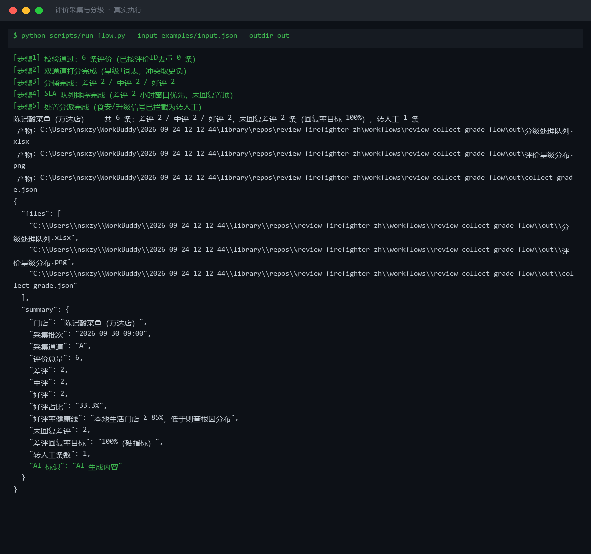
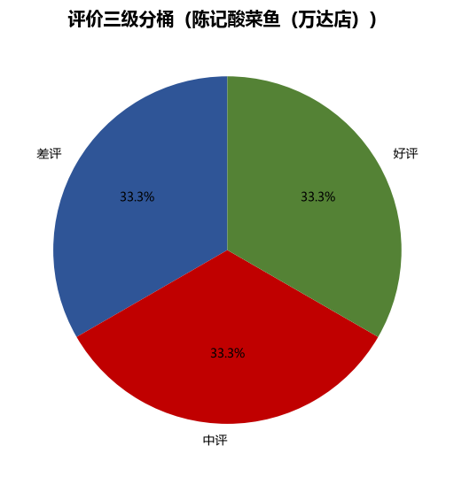
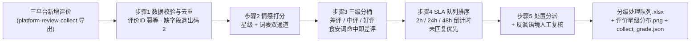

# 评价采集与分级 Review Collect Grade Flow

> 复合技能（工作流） ｜ 属于「口碑捍卫者」 ｜ 本地生活商家客群 ｜ T3 编排型（脚本交付真实文件） ｜ 触发：定时（每 2 小时巡检）
>
> **把三平台新增评价加工成一张可执行的分级处理队列：哪条差评进灭火流程、哪条中评藏改进点、哪条好评进复购运营。**
> 5 步真实 DAG · 星级 + 词表双通道情感打分（冲突取更负一档）· 三级分桶 · SLA 倒计时排序（差评 2h / 中评 24h / 好评 48h）· 食安词命中即转人工



*上图来自真实执行：`python scripts/run_flow.py --input examples/input.json --outdir out`，6 条评价 → 差评 2 / 中评 2 / 好评 2，转人工 1 条（食安信号「头发丝」），好评占比 33.3% 低于 ≥85% 健康线，产物落盘 Excel + PNG + JSON。*

## 实跑产物

| 文件 | 说明 |
|---|---|
| [`out/分级处理队列.xlsx`](out/分级处理队列.xlsx) | 处理队列（差评行标红）+ 汇总 |
|  | 三桶占比饼图（脚本自动生成） |
| `out/collect_grade.json` | 机器可读结果 |

## 它怎么分级（核心规则）

### 双通道情感打分（冲突时取更负一档）

| 通道 | 来源 | 说明 |
|---|---|---|
| 通道一 | 平台星级（1-5） | 1-2 差评 / 3 中评 / 4-5 好评 |
| 通道二 | 负面词表四档（差评/吐槽/食安/人身攻击）+ 正面词表 | 文本分 |

**3 星但文字很愤怒 → 按差评处理**——本地生活差评灭火的宁可错报原则。

### 三级分桶与 SLA

| 桶位 | 判定 | 响应窗口 |
|---|---|---|
| 差评 | 星级 ≤ 2，或命中「食安/人身攻击」词（无论星级） | **2 小时内**（黄金窗口，24 小时后效果减半） |
| 中评 | 星级 3 且无强负面词 | 24 小时内 |
| 好评 | 星级 ≥ 4 且无强负面词 | 48 小时内 |

食安类差评单独打标：后续流程不得自动回复，须转人工。**差评回复率 100% 是硬指标**，已回复差评仍入队列供对账。

## 真实输入 → 真实输出

**输入**（`examples/input.json`，6 条评价，节选）：

```json
{"id": "M-2201", "platform": "美团", "stars": 1, "text": "鱼汤里有头发丝，这还怎么吃，太恶心了", "reply_status": "未回复"},
{"id": "D-1103", "platform": "抖音", "stars": 3, "text": "真是绝了，等了两小时才吃上，真是谢谢了", "reply_status": "未回复"}
```

**输出**（脚本实跑，分级处理队列节选）：

| 评价ID | 平台 | 星级 | 桶位 | 强负面词 | 已回复 | 响应窗口 | 处置 |
|---|---|---|---|---|---|---|---|
| M-2202 | 美团 | 2 | 差评 | 履约:等了45分钟 | 未回复 | 2 小时内 | 转差评灭火流程 |
| M-2201 | 美团 | 1 | 差评 | 食安:头发丝；攻击/服务:恶心 | 未回复 | 2 小时内（转人工） | 转人工（升级信号），AI 停止自动回复 |
| D-1103 | 抖音 | 3 | 中评 | （无） | 未回复 | 24 小时内 | 提取改进点转周复盘；⚠ 反讽疑似，人工复核改桶 |
| P-3305 | 点评 | 5 | 好评 | （无） | 未回复 | 48 小时内 | 转好评感谢回复生成 |

完整 6 条与批次汇总见 [`examples/output.md`](examples/output.md)。

## 处理流水线



## 快速开始

**方式一：脚本（推荐，确定性分桶）**

```bash
# 演示模式（内置真实样例）
python scripts/run_flow.py --demo
# 指定输入
python scripts/run_flow.py --input examples/input.json --outdir out
```

**方式二：纯对话**

```text
1. 打开 prompt.txt，全文复制
2. 粘贴到 Coze / WorkBuddy / Dify / Claude / ChatGPT
3. 按 schema.json 提供：评价数组（id/platform/stars/text/review_time/reply_status）
```

失败处理：必需字段缺失 → 退出码 2 并列缺失清单，**不补默认值、不猜星级**；某桶为 0 → 显式写「0 条」不静默跳过。

## 面向谁 / 什么时候用

| ✅ 该用 | ❌ 别用 |
|---|---|
| 每 2 小时巡检三平台新增评价，替代人工刷后台（月省 ≈ 15 小时） | 直接发布回复——本流程只产出队列，发布由下游流程 + 人工确认 |
| 保证差评回复率 100% 的队列对账 | 把食安/人身攻击评价降档处理——命中即最高优先级转人工 |
| 识别 3 星反讽评价（「真是绝了，等了两小时」） | 数据缺失时补零凑数——缺失评价单独标注，不混入统计 |

## 边界与合规

- 本资产输出为 **AI 辅助生成内容**，队列中的客户昵称保持平台展示原样
- 差评响应与回复遵守平台评价规范；采集层合规见 [platform-review-collect](../../skills/platform-review-collect/)
- 涉及食安与集体投诉的内容一律人工优先，AI 仅做分桶提示

## 文件地图

```text
├── README.md                ← 本文件
├── SKILL.md                 ← 资产定义（元信息 / 契约 / 边界）
├── prompt.txt               ← 提示词本体（5 步分步指令 + DAG + 禁止项）
├── schema.json              ← 输入输出契约（机器可读）
├── scripts/run_flow.py      ← 确定性编排脚本（双通道打分 → 分桶 → SLA 队列）
├── examples/                ← 真实输入 + 脚本实跑输出
├── docs/                    ← 9 项配套文档（架构 / 流程 / 场景 / 测试报告…）
└── out/                     ← 实跑产物（分级处理队列.xlsx / 评价星级分布.png / collect_grade.json）
```

**编排关系**：消费 [platform-review-collect](../../skills/platform-review-collect/) 的评价流；差评桶 → [negative-review-extinguish-flow](../negative-review-extinguish-flow/)，好评桶 → [positive-review-thanks-flow](../positive-review-thanks-flow/)。

---

*本资产遵循 [bangwozuo 数字员工资产规范](https://github.com/bangwozuo/digital-employee-spec) v3.0 ｜ [所属员工：口碑捍卫者](../../) ｜ [总入口](https://github.com/bangwozuo/digital-employees-hub-zh)*
