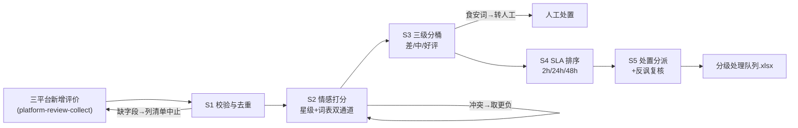

# 评价采集与分级

## 元信息

| 字段 | 值 |
|------|-----|
| ID | `de_local_02_wf01` |
| 类型 | **`composite`（复合技能 / T3 工作流）** |
| 所属员工 | 口碑捍卫者 |
| 阶段 | `P0` |
| 复杂度 | `M` |
| 触发方式 | 定时（每 2 小时巡检）或事件（新评价推送） |
| 资产形态 | 编排提示词 + Python 编排脚本（无模型调用、无 API Key） |

## 能力描述

把三平台新增评价加工成可执行的分级处理队列：数据校验与幂等去重（评价ID 键，字段缺失退出码 2 列清单）→ 情感打分（**星级 + 词表双通道，冲突取更负一档**：3 星但文字愤怒按差评处理）→ 三级分桶（差评 / 中评 / 好评；**食安与人身攻击词命中即按差评最高优先级并转人工**，无论星级）→ SLA 队列排序（差评 2 小时黄金窗口 > 中评 24 小时 > 好评 48 小时，未回复置顶）→ 处置分派（灭火流程 / 周复盘 / 好评感谢流程）与反讽疑似人工复核。**数值由 `scripts/run_flow.py` 计算，模型只做语境复核与分派把关。**

## 编排的原子技能

| # | 原子技能 | 在本流程中的角色 |
|---|---------|------|
| 1 | [平台评价采集](../../skills/platform-review-collect/) | 数据源：三平台新增评价导出（A/B 双通道） |
| 2 | [点评回复生成](../../skills/review-reply-generate/) | 好评/中评处置的下游撰写技能 |
| 3 | [差评应对话术库](../../skills/negative-review-script-lib/) | 差评处置的下游话术技能 |
| 4 | [回复合规审核](../../skills/reply-compliance-review/) | 下游回复的发布前关卡 |

## 步骤链路（DAG）



## 步骤明细

| # | 步骤 | 执行者 | 输入 | 输出 | 失败处理 |
|---|------|---------|------|------|---------|
| 1 | 校验与去重 | 脚本 | 评价数组 | 合格评价集 | 字段缺失退出码 2 列清单；平台名非法退出；通道 B 标注 T+1 |
| 2 | 情感打分 | 脚本 | 合格评价集 | 星级分 + 文本分 + 命中证据 | 双通道冲突取更负；纯星级评价标「简版」不虚构正文 |
| 3 | 三级分桶 | 脚本 | 打分结果 | 差/中/好评三桶 | 桶空显式写 0；食安/攻击词无论星级入差评桶 |
| 4 | SLA 排序 | 脚本 | 分桶结果 | 带响应窗口队列 | 发布时间缺失排末位标注；已回复差评仍入队对账 |
| 5 | 处置分派 | 模型+人工 | 处理队列 | 分派指令 | 食安/升级信号转人工；反讽疑似人工复核改桶 |

## 输入规格

| 字段 | 类型 | 必填 | 说明 |
|------|------|------|------|
| `shop` | string | ⬜ | 门店名 |
| `collect_at` | string | ⬜ | 采集批次时间 |
| `channel` | string | ⬜ | A=开放接口 / B=人工导出 |
| `reviews` | array | ✅ | [{id, platform, stars, text, review_time, reply_status, order_id}] |

## 输出规格

| 字段 | 类型 | 说明 |
|------|------|------|
| `summary` | object | 三桶计数 / 未回复差评 / 转人工条数 / 好评占比对照 ≥85% 健康线 |
| `items` | array | 分级处理队列（评价ID / 星级 / 桶位 / 强负面词 / 响应窗口 / 处置） |
| 产物 | 文件 | `out/分级处理队列.xlsx`（差评行标红）、`out/评价星级分布.png`、`out/collect_grade.json` |

## 验收标准

- [ ] 每一步的技能资产齐全（SKILL.md / prompt.txt / schema.json）
- [ ] 步骤间输入输出字段可衔接（评价 → 打分 → 分桶 → 队列 → 分派）
- [ ] 食安/升级信号评价 100% 拦截为转人工，AI 不自动回复
- [ ] 末步输出带 AI 生成标识，回复发布动作保留人工确认

## 使用步骤

### 方式一：带脚本（推荐，端到端）

```bash
python3 <WF_DIR>/scripts/run_flow.py --input input.json --outdir out
python3 <WF_DIR>/scripts/run_flow.py --demo        # 无输入也能看效果
```

### 方式二：纯对话编排

把 `prompt.txt` 全文粘贴为系统提示词 → 提供评价数据 → 按 DAG 逐步执行，
末步产出分级处理队列表（语境复核由模型补全）。

### 平台编排

| 平台 | 编排方式 |
|------|---------|
| **Coze / 扣子** | 新建工作流 → 按步骤添加节点，每节点填对应技能 prompt.txt |
| **Dify** | Workflow → LLM 节点链按 DAG 连接，步骤 1-4 用代码节点调 run_flow.py 逻辑 |
| **WorkBuddy** | 新建 Skill 按步骤串联各技能提示词 |

## 边界（不做的事）

- ❌ 不降档处理——食安、人身攻击词命中即最高优先级，无论星级
- ❌ 不虚构细节——纯星级评价标「简版」走私信确认，不补写正文
- ❌ 不漏差评——已回复差评也进队列，回复率按全量 100% 对账
- ❌ 不自动发布——本流程只产出队列，回复动作由下游流程 + 人工确认完成
- ❌ 数据缺失不补零——发布时间/平台缺失的评价单独标注，不混入统计

## 调用示例

**输入**（`examples/input.json`）：陈记酸菜鱼，通道 A，6 条评价（含 1 星食安、2 星等位、3 星反讽、4-5 星好评）。

**输出**（脚本实跑，退出码 0）：

| 评价ID | 桶位 | 强负面词 | 响应窗口 | 处置 |
|---|---|---|---|---|
| M-2202 | 差评 | 履约:等了45分钟 | 2 小时内 | 转差评灭火流程 |
| M-2201 | 差评 | 食安:头发丝 | 2 小时内（转人工） | AI 停止自动回复 |
| D-1103 | 中评 | （无） | 24 小时内 | 周复盘；⚠ 反讽疑似复核 |
| P-3305 / D-1104 | 好评 | （无） | 48 小时内 | 转好评感谢流程 |

未回复差评 2 条；转人工 1 条；好评占比 33.3%（低于 85% 健康线告警）。

## 所属工作流

本资产为复合技能（工作流），是独立的端到端流程，不隶属于其他工作流。

## 合规声明

- 本技能输出为 **AI 辅助生成内容**，回复发布前必须经店主人工确认
- 评价数据仅用于本店口碑运营；客户昵称保持平台展示原样，不追加采集个人信息
- 涉及食安与集体投诉的内容人工优先，AI 仅做分桶提示

---

*本复合技能遵循 [bangwozuo 数字员工资产规范](https://github.com/bangwozuo/digital-employee-spec) v3.0*
